# [📈 Live Status](https://tinyurl.com/jagoanuptime): <!--live status--> **🟧 Partial outage**

<!--start: status pages-->
<!-- This summary is generated by Upptime (https://github.com/upptime/upptime) -->
<!-- Do not edit this manually, your changes will be overwritten -->
<!-- prettier-ignore -->
| URL | Status | History | Response Time | Uptime |
| --- | ------ | ------- | ------------- | ------ |
|  [Jagoanssh - Website](jagoanssh.com) | 🟩 Up | [jagoanssh-website.yml](https://github.com/serversshnet/uptime/commits/HEAD/history/jagoanssh-website.yml) | 

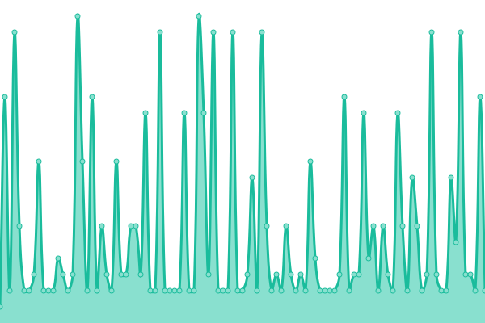 6ms
     
 | 

<a href="https://uptime.jagoanssh.com/history/jagoanssh-website">100.00%</a>
    

|  [sg1.ipservers.xyz](sg1.ipservers.xyz) | 🟥 Down | [sg1-ipservers-xyz.yml](https://github.com/serversshnet/uptime/commits/HEAD/history/sg1-ipservers-xyz.yml) | 

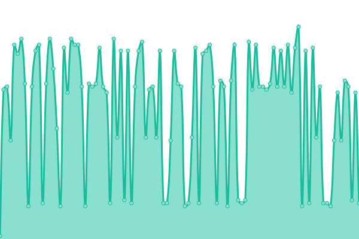 0ms
     
 | 

<a href="https://uptime.jagoanssh.com/history/sg1-ipservers-xyz">0.00%</a>
    

|  [sg2.ipservers.xyz](sg2.ipservers.xyz) | 🟥 Down | [sg2-ipservers-xyz.yml](https://github.com/serversshnet/uptime/commits/HEAD/history/sg2-ipservers-xyz.yml) | 

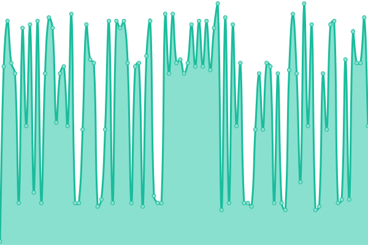 0ms
     
 | 

<a href="https://uptime.jagoanssh.com/history/sg2-ipservers-xyz">0.00%</a>
    

|  [sg3.ipservers.xyz](sg3.ipservers.xyz) | 🟥 Down | [sg3-ipservers-xyz.yml](https://github.com/serversshnet/uptime/commits/HEAD/history/sg3-ipservers-xyz.yml) | 

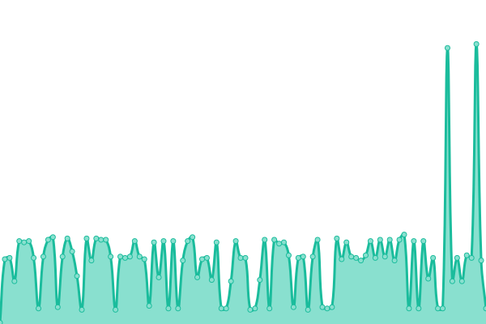 0ms
     
 | 

<a href="https://uptime.jagoanssh.com/history/sg3-ipservers-xyz">0.00%</a>
    

|  [sg4.ipservers.xyz](sg4.ipservers.xyz) | 🟥 Down | [sg4-ipservers-xyz.yml](https://github.com/serversshnet/uptime/commits/HEAD/history/sg4-ipservers-xyz.yml) | 

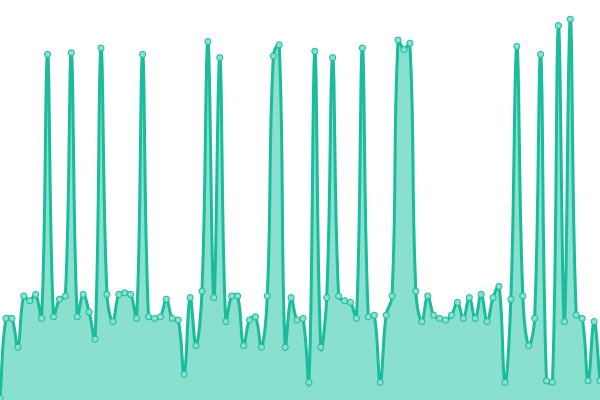 0ms
     
 | 

<a href="https://uptime.jagoanssh.com/history/sg4-ipservers-xyz">0.00%</a>
    

|  [us1.ipservers.xyz](us1.ipservers.xyz) | 🟥 Down | [us1-ipservers-xyz.yml](https://github.com/serversshnet/uptime/commits/HEAD/history/us1-ipservers-xyz.yml) | 

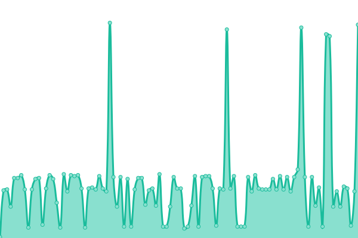 0ms
     
 | 

<a href="https://uptime.jagoanssh.com/history/us1-ipservers-xyz">0.00%</a>
    

|  [uk1.ipservers.xyz](uk1.ipservers.xyz) | 🟥 Down | [uk1-ipservers-xyz.yml](https://github.com/serversshnet/uptime/commits/HEAD/history/uk1-ipservers-xyz.yml) | 

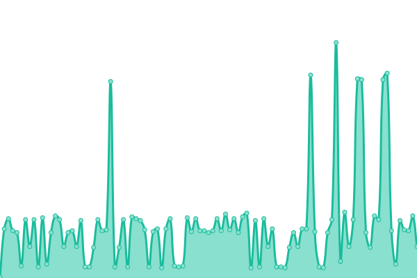 0ms
     
 | 

<a href="https://uptime.jagoanssh.com/history/uk1-ipservers-xyz">0.00%</a>
    

|  [sg1-7.ipservers.xyz](sg1-7.ipservers.xyz) | 🟥 Down | [sg1-7-ipservers-xyz.yml](https://github.com/serversshnet/uptime/commits/HEAD/history/sg1-7-ipservers-xyz.yml) | 

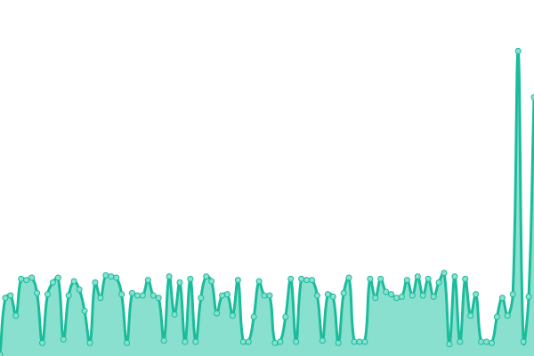 0ms
     
 | 

<a href="https://uptime.jagoanssh.com/history/sg1-7-ipservers-xyz">0.00%</a>
    

|  [sg2-7.ipservers.xyz](sg2-7.ipservers.xyz) | 🟥 Down | [sg2-7-ipservers-xyz.yml](https://github.com/serversshnet/uptime/commits/HEAD/history/sg2-7-ipservers-xyz.yml) | 

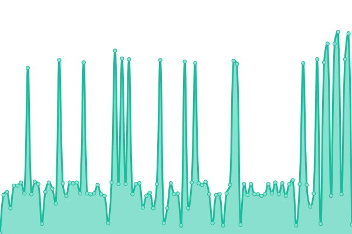 0ms
     
 | 

<a href="https://uptime.jagoanssh.com/history/sg2-7-ipservers-xyz">0.00%</a>
    

|  [sg3-7.ipservers.xyz](sg3-7.ipservers.xyz) | 🟥 Down | [sg3-7-ipservers-xyz.yml](https://github.com/serversshnet/uptime/commits/HEAD/history/sg3-7-ipservers-xyz.yml) | 

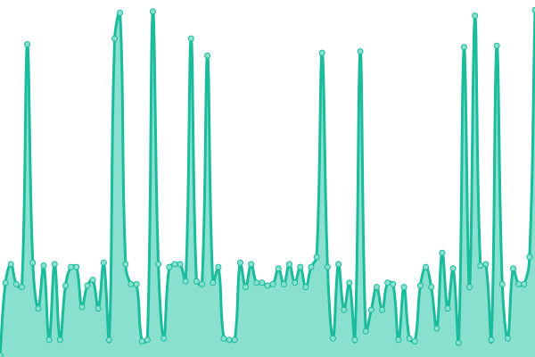 0ms
     
 | 

<a href="https://uptime.jagoanssh.com/history/sg3-7-ipservers-xyz">0.00%</a>
    

|  [sg4-7.ipservers.xyz](sg4-7.ipservers.xyz) | 🟥 Down | [sg4-7-ipservers-xyz.yml](https://github.com/serversshnet/uptime/commits/HEAD/history/sg4-7-ipservers-xyz.yml) | 

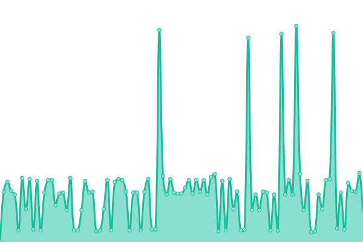 0ms
     
 | 

<a href="https://uptime.jagoanssh.com/history/sg4-7-ipservers-xyz">0.00%</a>
    

|  [us1-7.ipservers.xyz](us1-7.ipservers.xyz) | 🟥 Down | [us1-7-ipservers-xyz.yml](https://github.com/serversshnet/uptime/commits/HEAD/history/us1-7-ipservers-xyz.yml) | 

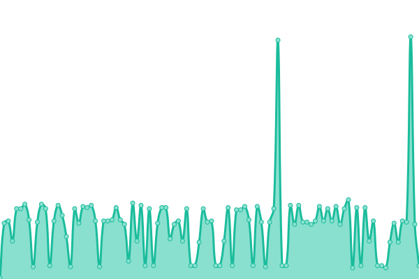 0ms
     
 | 

<a href="https://uptime.jagoanssh.com/history/us1-7-ipservers-xyz">0.00%</a>
    

|  [uk1-7.ipservers.xyz](uk1-7.ipservers.xyz) | 🟥 Down | [uk1-7-ipservers-xyz.yml](https://github.com/serversshnet/uptime/commits/HEAD/history/uk1-7-ipservers-xyz.yml) | 

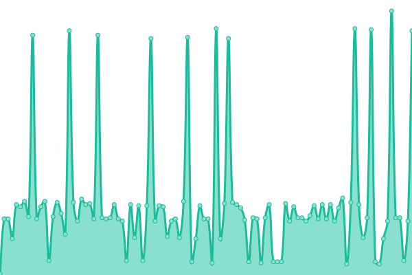 0ms
     
 | 

<a href="https://uptime.jagoanssh.com/history/uk1-7-ipservers-xyz">0.00%</a>
    

|  [sg1-30.ipservers.xyz](sg1-30.ipservers.xyz) | 🟥 Down | [sg1-30-ipservers-xyz.yml](https://github.com/serversshnet/uptime/commits/HEAD/history/sg1-30-ipservers-xyz.yml) | 

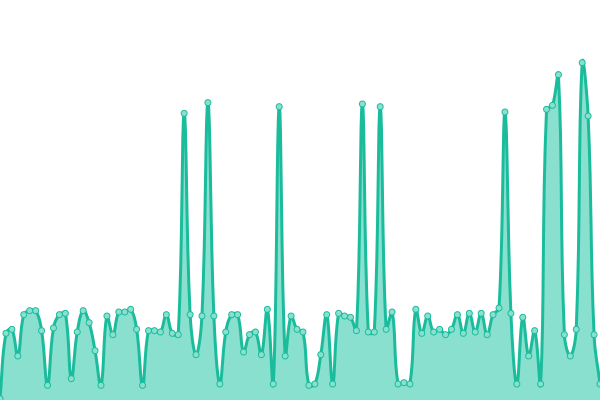 0ms
     
 | 

<a href="https://uptime.jagoanssh.com/history/sg1-30-ipservers-xyz">0.00%</a>
    

|  [sg2-30.ipservers.xyz](sg2-30.ipservers.xyz) | 🟥 Down | [sg2-30-ipservers-xyz.yml](https://github.com/serversshnet/uptime/commits/HEAD/history/sg2-30-ipservers-xyz.yml) | 

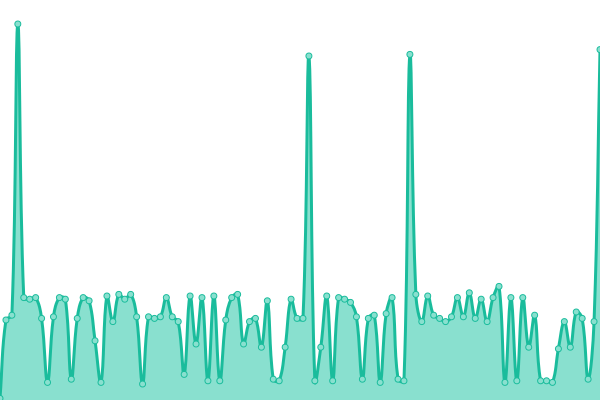 0ms
     
 | 

<a href="https://uptime.jagoanssh.com/history/sg2-30-ipservers-xyz">0.00%</a>
    

|  [sg3-30.ipservers.xyz](sg3-30.ipservers.xyz) | 🟥 Down | [sg3-30-ipservers-xyz.yml](https://github.com/serversshnet/uptime/commits/HEAD/history/sg3-30-ipservers-xyz.yml) | 

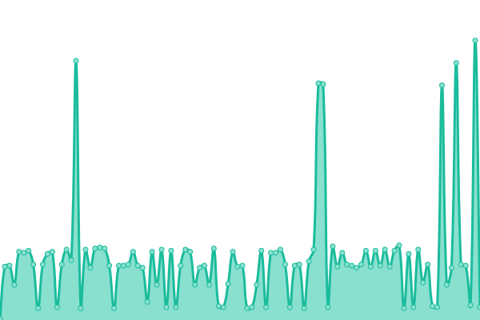 0ms
     
 | 

<a href="https://uptime.jagoanssh.com/history/sg3-30-ipservers-xyz">0.00%</a>
    

|  [sg4-30.ipservers.xyz](sg4-30.ipservers.xyz) | 🟥 Down | [sg4-30-ipservers-xyz.yml](https://github.com/serversshnet/uptime/commits/HEAD/history/sg4-30-ipservers-xyz.yml) | 

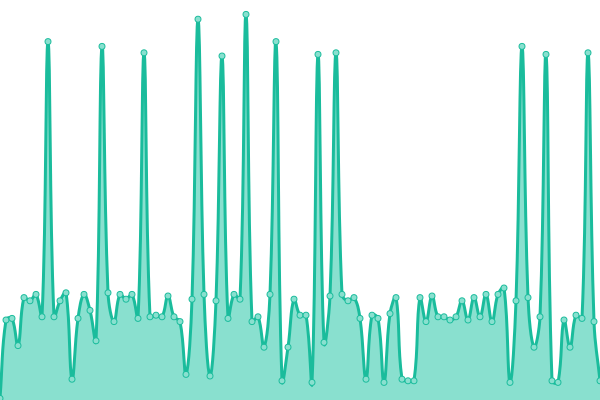 0ms
     
 | 

<a href="https://uptime.jagoanssh.com/history/sg4-30-ipservers-xyz">0.00%</a>
    

|  [us1-30.ipservers.xyz](us1-30.ipservers.xyz) | 🟥 Down | [us1-30-ipservers-xyz.yml](https://github.com/serversshnet/uptime/commits/HEAD/history/us1-30-ipservers-xyz.yml) | 

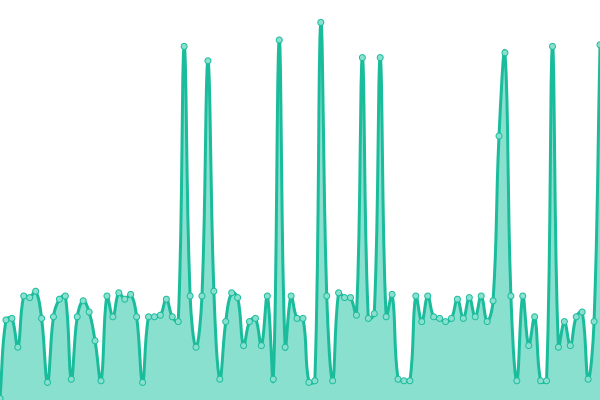 0ms
     
 | 

<a href="https://uptime.jagoanssh.com/history/us1-30-ipservers-xyz">0.00%</a>
    

|  [uk1-30.ipservers.xyz](uk1-30.ipservers.xyz) | 🟥 Down | [uk1-30-ipservers-xyz.yml](https://github.com/serversshnet/uptime/commits/HEAD/history/uk1-30-ipservers-xyz.yml) | 

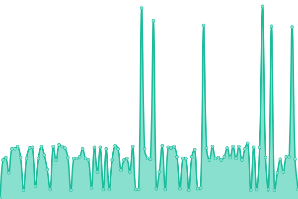 0ms
     
 | 

<a href="https://uptime.jagoanssh.com/history/uk1-30-ipservers-xyz">0.00%</a>
    

|  [id1-7.ipservers.xyz](id1-7.ipservers.xyz) | 🟥 Down | [id1-7-ipservers-xyz.yml](https://github.com/serversshnet/uptime/commits/HEAD/history/id1-7-ipservers-xyz.yml) | 

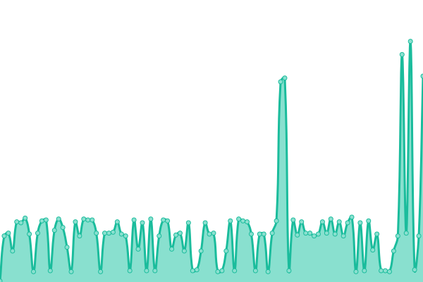 0ms
     
 | 

<a href="https://uptime.jagoanssh.com/history/id1-7-ipservers-xyz">0.00%</a>
    

|  [vip.ipservers.xyz](vip.ipservers.xyz) | 🟥 Down | [vip-ipservers-xyz.yml](https://github.com/serversshnet/uptime/commits/HEAD/history/vip-ipservers-xyz.yml) | 

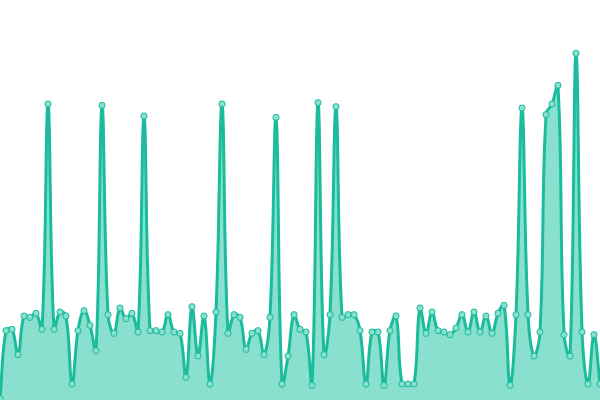 0ms
     
 | 

<a href="https://uptime.jagoanssh.com/history/vip-ipservers-xyz">0.00%</a>
    

|  [id.ipservers.xyz](id.ipservers.xyz) | 🟥 Down | [id-ipservers-xyz.yml](https://github.com/serversshnet/uptime/commits/HEAD/history/id-ipservers-xyz.yml) | 

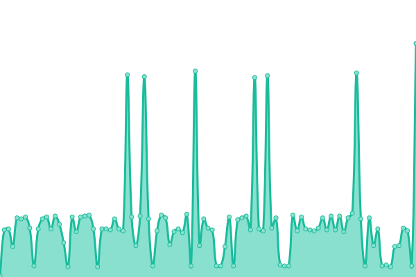 0ms
     
 | 

<a href="https://uptime.jagoanssh.com/history/id-ipservers-xyz">0.00%</a>
    

|  [id2-7.ipservers.xyz](id2-7.ipservers.xyz) | 🟥 Down | [id2-7-ipservers-xyz.yml](https://github.com/serversshnet/uptime/commits/HEAD/history/id2-7-ipservers-xyz.yml) | 

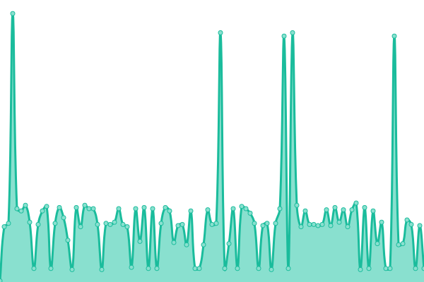 0ms
     
 | 

<a href="https://uptime.jagoanssh.com/history/id2-7-ipservers-xyz">0.00%</a>
    

|  [id2.ipservers.xyz](id2.ipservers.xyz) | 🟥 Down | [id2-ipservers-xyz.yml](https://github.com/serversshnet/uptime/commits/HEAD/history/id2-ipservers-xyz.yml) | 

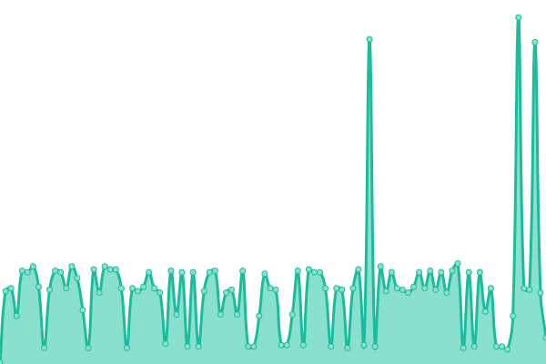 0ms
     
 | 

<a href="https://uptime.jagoanssh.com/history/id2-ipservers-xyz">0.00%</a>
    

|  [id3.ipservers.xyz](id3.ipservers.xyz) | 🟥 Down | [id3-ipservers-xyz.yml](https://github.com/serversshnet/uptime/commits/HEAD/history/id3-ipservers-xyz.yml) | 

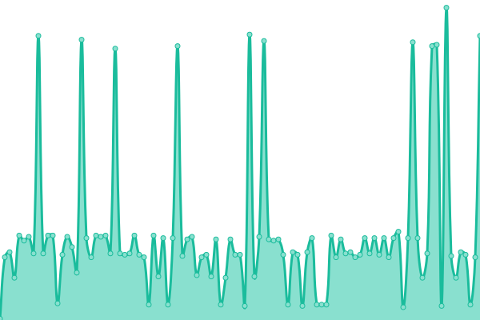 0ms
     
 | 

<a href="https://uptime.jagoanssh.com/history/id3-ipservers-xyz">0.00%</a>
    

|  [id3-7.ipservers.xyz](id3-7.ipservers.xyz) | 🟥 Down | [id3-7-ipservers-xyz.yml](https://github.com/serversshnet/uptime/commits/HEAD/history/id3-7-ipservers-xyz.yml) | 

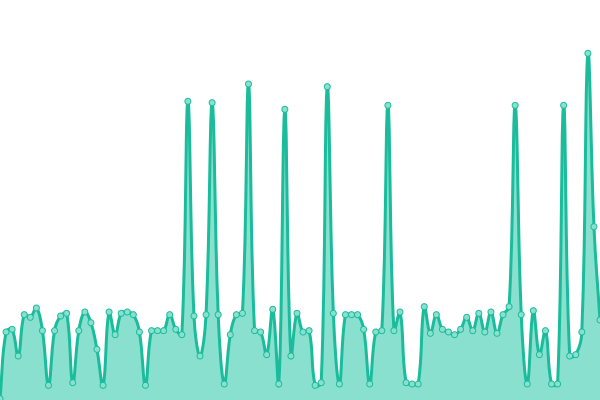 0ms
     
 | 

<a href="https://uptime.jagoanssh.com/history/id3-7-ipservers-xyz">0.00%</a>
    

|  [vip2.ipservers.xyz](vip2.ipservers.xyz) | 🟥 Down | [vip2-ipservers-xyz.yml](https://github.com/serversshnet/uptime/commits/HEAD/history/vip2-ipservers-xyz.yml) | 

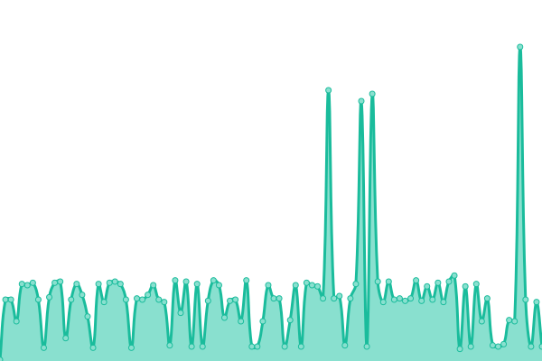 0ms
     
 | 

<a href="https://uptime.jagoanssh.com/history/vip2-ipservers-xyz">0.00%</a>
    

|  [sg1socks.ipservers.xyz](sg1socks.ipservers.xyz) | 🟥 Down | [sg1socks-ipservers-xyz.yml](https://github.com/serversshnet/uptime/commits/HEAD/history/sg1socks-ipservers-xyz.yml) | 

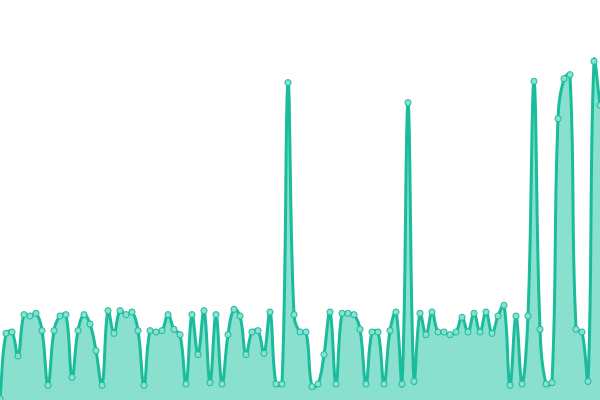 0ms
     
 | 

<a href="https://uptime.jagoanssh.com/history/sg1socks-ipservers-xyz">0.00%</a>
    

|  [sg1vpn.jagoanssh.com](sg1vpn.jagoanssh.com) | 🟩 Up | [sg1vpn-jagoanssh-com.yml](https://github.com/serversshnet/uptime/commits/HEAD/history/sg1vpn-jagoanssh-com.yml) | 

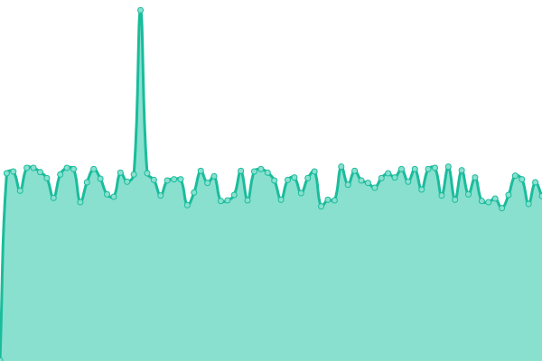 280ms
     
 | 

<a href="https://uptime.jagoanssh.com/history/sg1vpn-jagoanssh-com">100.00%</a>
    

|  [sg2vpn.jagoanssh.com](sg2vpn.jagoanssh.com) | 🟥 Down | [sg2vpn-jagoanssh-com.yml](https://github.com/serversshnet/uptime/commits/HEAD/history/sg2vpn-jagoanssh-com.yml) | 

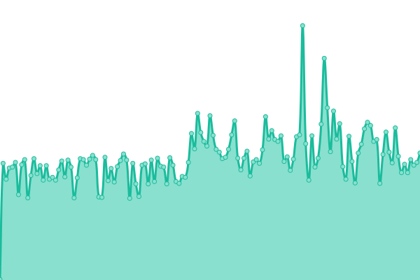 0ms
     
 | 

<a href="https://uptime.jagoanssh.com/history/sg2vpn-jagoanssh-com">0.00%</a>
    

|  [sg3vpn.jagoanssh.com](sg3vpn.jagoanssh.com) | 🟩 Up | [sg3vpn-jagoanssh-com.yml](https://github.com/serversshnet/uptime/commits/HEAD/history/sg3vpn-jagoanssh-com.yml) | 

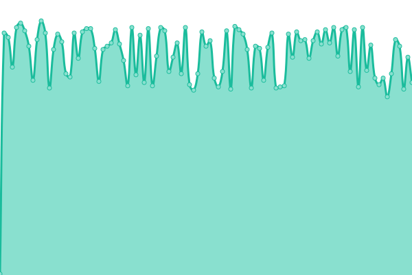 200ms
     
 | 

<a href="https://uptime.jagoanssh.com/history/sg3vpn-jagoanssh-com">100.00%</a>
    

|  [id1vpn.jagoanssh.com](id1vpn.jagoanssh.com) | 🟥 Down | [id1vpn-jagoanssh-com.yml](https://github.com/serversshnet/uptime/commits/HEAD/history/id1vpn-jagoanssh-com.yml) | 

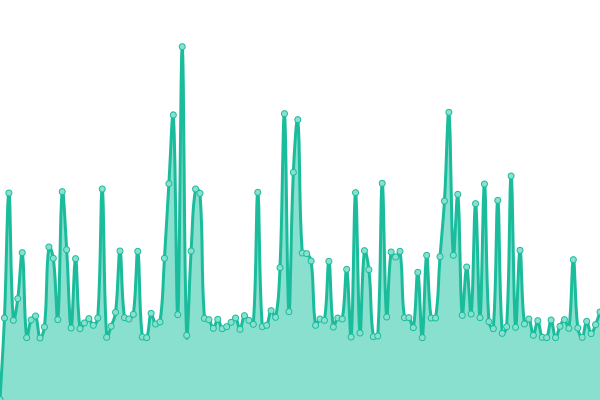 0ms
     
 | 

<a href="https://uptime.jagoanssh.com/history/id1vpn-jagoanssh-com">0.00%</a>
    

|  [id2vpn.jagoanssh.com](id2vpn.jagoanssh.com) | 🟥 Down | [id2vpn-jagoanssh-com.yml](https://github.com/serversshnet/uptime/commits/HEAD/history/id2vpn-jagoanssh-com.yml) | 

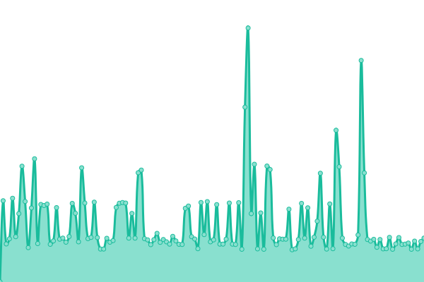 0ms
     
 | 

<a href="https://uptime.jagoanssh.com/history/id2vpn-jagoanssh-com">0.00%</a>
    

|  [idx1vpn.jagoanssh.com](idx1vpn.jagoanssh.com) | 🟥 Down | [idx1vpn-jagoanssh-com.yml](https://github.com/serversshnet/uptime/commits/HEAD/history/idx1vpn-jagoanssh-com.yml) | 

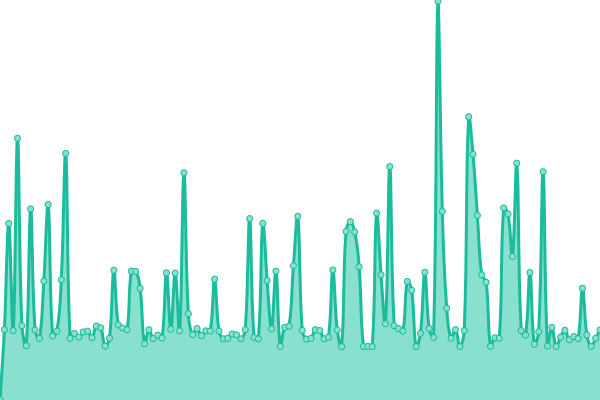 0ms
     
 | 

<a href="https://uptime.jagoanssh.com/history/idx1vpn-jagoanssh-com">0.00%</a>
    

|  [idx2vpn.jagoanssh.com](idx2vpn.jagoanssh.com) | 🟥 Down | [idx2vpn-jagoanssh-com.yml](https://github.com/serversshnet/uptime/commits/HEAD/history/idx2vpn-jagoanssh-com.yml) | 

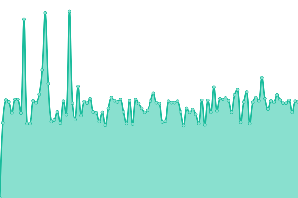 0ms
     
 | 

<a href="https://uptime.jagoanssh.com/history/idx2vpn-jagoanssh-com">0.00%</a>
    

|  [sgxvpn.jagoanssh.com](sgxvpn.jagoanssh.com) | 🟥 Down | [sgxvpn-jagoanssh-com.yml](https://github.com/serversshnet/uptime/commits/HEAD/history/sgxvpn-jagoanssh-com.yml) | 

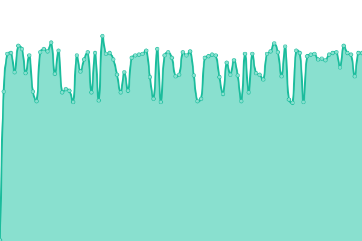 0ms
     
 | 

<a href="https://uptime.jagoanssh.com/history/sgxvpn-jagoanssh-com">0.00%</a>
    

|  [fr.ipservers.xyz](fr.ipservers.xyz) | 🟥 Down | [fr-ipservers-xyz.yml](https://github.com/serversshnet/uptime/commits/HEAD/history/fr-ipservers-xyz.yml) | 

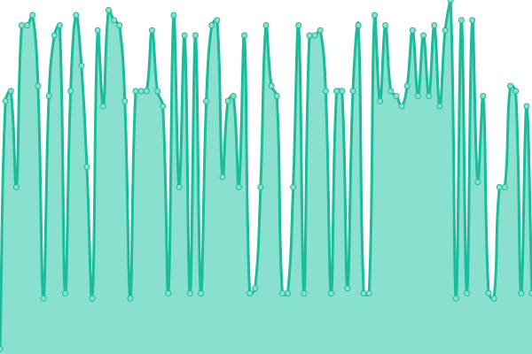 0ms
     
 | 

<a href="https://uptime.jagoanssh.com/history/fr-ipservers-xyz">0.00%</a>
    

|  [ge.ipservers.xyz](ge.ipservers.xyz) | 🟥 Down | [ge-ipservers-xyz.yml](https://github.com/serversshnet/uptime/commits/HEAD/history/ge-ipservers-xyz.yml) | 

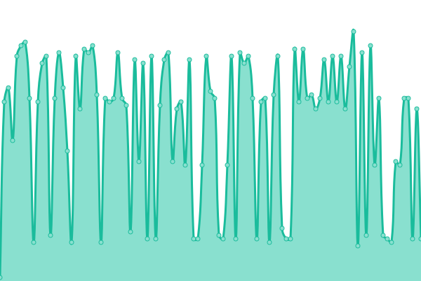 0ms
     
 | 

<a href="https://uptime.jagoanssh.com/history/ge-ipservers-xyz">0.00%</a>
    

|  [sg5.ipservers.xyz](sg5.ipservers.xyz) | 🟥 Down | [sg5-ipservers-xyz.yml](https://github.com/serversshnet/uptime/commits/HEAD/history/sg5-ipservers-xyz.yml) | 

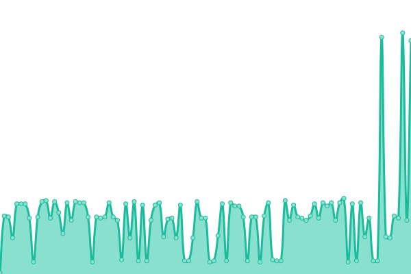 0ms
     
 | 

<a href="https://uptime.jagoanssh.com/history/sg5-ipservers-xyz">0.00%</a>
    

|  [sg6.ipservers.xyz](sg6.ipservers.xyz) | 🟥 Down | [sg6-ipservers-xyz.yml](https://github.com/serversshnet/uptime/commits/HEAD/history/sg6-ipservers-xyz.yml) | 

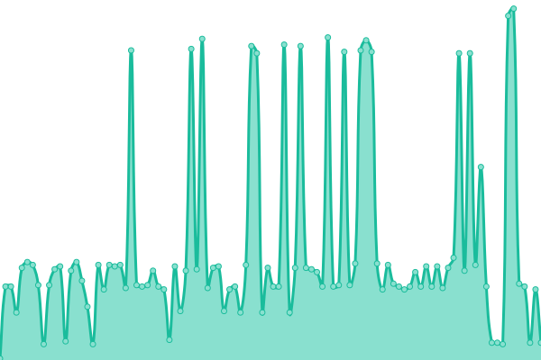 0ms
     
 | 

<a href="https://uptime.jagoanssh.com/history/sg6-ipservers-xyz">0.00%</a>
    

|  [sg1tp.ipservers.xyz](sg1tp.ipservers.xyz) | 🟥 Down | [sg1tp-ipservers-xyz.yml](https://github.com/serversshnet/uptime/commits/HEAD/history/sg1tp-ipservers-xyz.yml) | 

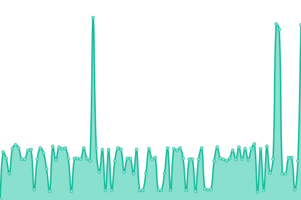 0ms
     
 | 

<a href="https://uptime.jagoanssh.com/history/sg1tp-ipservers-xyz">0.00%</a>
    

|  [sg2tp.ipservers.xyz](sg2tp.ipservers.xyz) | 🟥 Down | [sg2tp-ipservers-xyz.yml](https://github.com/serversshnet/uptime/commits/HEAD/history/sg2tp-ipservers-xyz.yml) | 

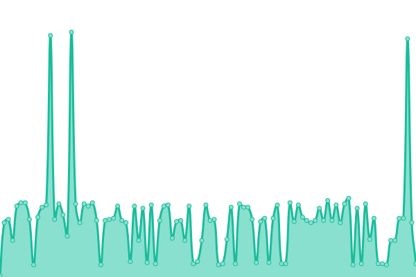 0ms
     
 | 

<a href="https://uptime.jagoanssh.com/history/sg2tp-ipservers-xyz">0.00%</a>
    

|  [fr1-7.ipservers.xyz](fr1-7.ipservers.xyz) | 🟥 Down | [fr1-7-ipservers-xyz.yml](https://github.com/serversshnet/uptime/commits/HEAD/history/fr1-7-ipservers-xyz.yml) | 

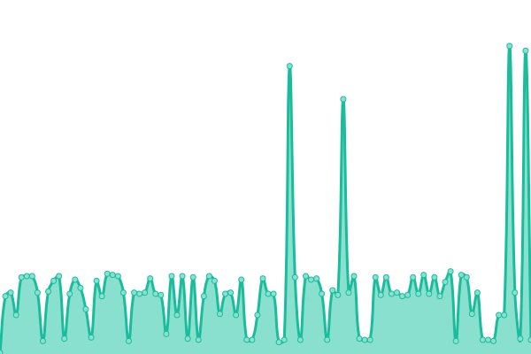 0ms
     
 | 

<a href="https://uptime.jagoanssh.com/history/fr1-7-ipservers-xyz">0.00%</a>
    

|  [ge1-7.ipservers.xyz](ge1-7.ipservers.xyz) | 🟥 Down | [ge1-7-ipservers-xyz.yml](https://github.com/serversshnet/uptime/commits/HEAD/history/ge1-7-ipservers-xyz.yml) | 

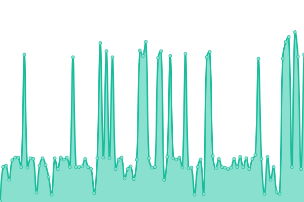 0ms
     
 | 

<a href="https://uptime.jagoanssh.com/history/ge1-7-ipservers-xyz">0.00%</a>
    

|  [sg-ray.ipservers.xyz](sg-ray.ipservers.xyz) | 🟥 Down | [sg-ray-ipservers-xyz.yml](https://github.com/serversshnet/uptime/commits/HEAD/history/sg-ray-ipservers-xyz.yml) | 

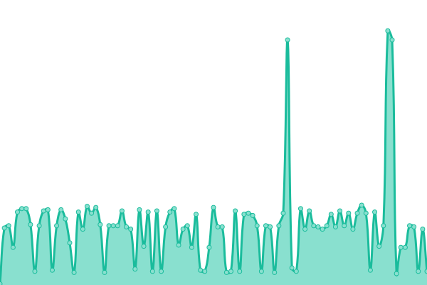 0ms
     
 | 

<a href="https://uptime.jagoanssh.com/history/sg-ray-ipservers-xyz">0.00%</a>
    

|  [sg2-ray.ipservers.xyz](sg2-ray.ipservers.xyz) | 🟥 Down | [sg2-ray-ipservers-xyz.yml](https://github.com/serversshnet/uptime/commits/HEAD/history/sg2-ray-ipservers-xyz.yml) | 

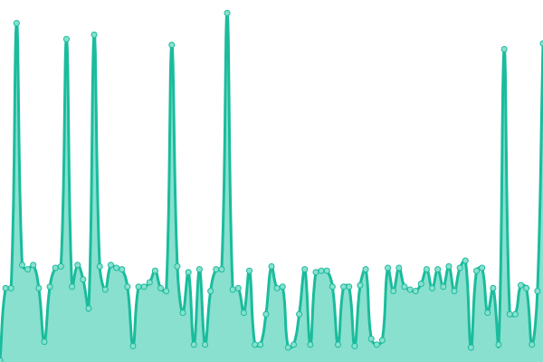 0ms
     
 | 

<a href="https://uptime.jagoanssh.com/history/sg2-ray-ipservers-xyz">0.00%</a>
    

|  [sg3-ray.ipservers.xyz](sg3-ray.ipservers.xyz) | 🟥 Down | [sg3-ray-ipservers-xyz.yml](https://github.com/serversshnet/uptime/commits/HEAD/history/sg3-ray-ipservers-xyz.yml) | 

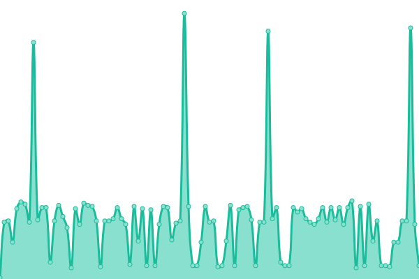 0ms
     
 | 

<a href="https://uptime.jagoanssh.com/history/sg3-ray-ipservers-xyz">0.00%</a>
    

|  [sg2socks.ipservers.xyz](sg2socks.ipservers.xyz) | 🟥 Down | [sg2socks-ipservers-xyz.yml](https://github.com/serversshnet/uptime/commits/HEAD/history/sg2socks-ipservers-xyz.yml) | 

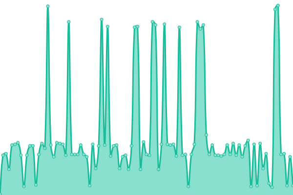 0ms
     
 | 

<a href="https://uptime.jagoanssh.com/history/sg2socks-ipservers-xyz">0.00%</a>
    

|  [idsocks.ipservers.xyz](idsocks.ipservers.xyz) | 🟥 Down | [idsocks-ipservers-xyz.yml](https://github.com/serversshnet/uptime/commits/HEAD/history/idsocks-ipservers-xyz.yml) | 

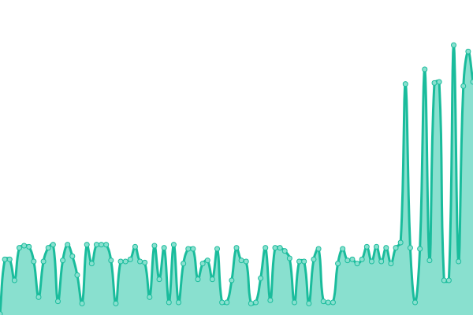 0ms
     
 | 

<a href="https://uptime.jagoanssh.com/history/idsocks-ipservers-xyz">0.00%</a>
    

|  [id2socks.ipservers.xyz](id2socks.ipservers.xyz) | 🟥 Down | [id2socks-ipservers-xyz.yml](https://github.com/serversshnet/uptime/commits/HEAD/history/id2socks-ipservers-xyz.yml) | 

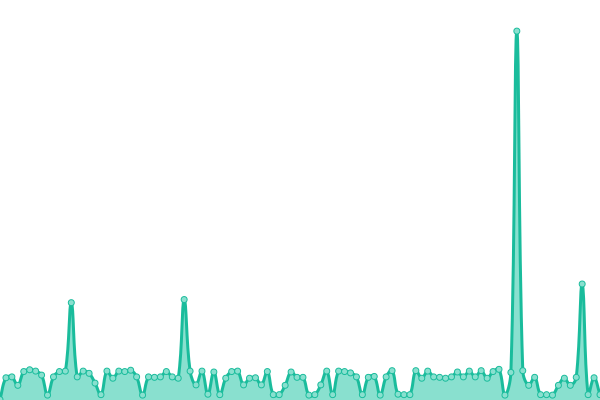 0ms
     
 | 

<a href="https://uptime.jagoanssh.com/history/id2socks-ipservers-xyz">0.00%</a>
    

|  [sg4-ray.ipservers.xyz](sg4-ray.ipservers.xyz) | 🟥 Down | [sg4-ray-ipservers-xyz.yml](https://github.com/serversshnet/uptime/commits/HEAD/history/sg4-ray-ipservers-xyz.yml) | 

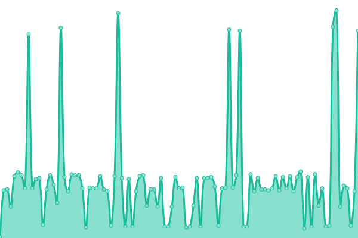 0ms
     
 | 

<a href="https://uptime.jagoanssh.com/history/sg4-ray-ipservers-xyz">0.00%</a>
    

|  [sg5-ray.ipservers.xyz](sg5-ray.ipservers.xyz) | 🟥 Down | [sg5-ray-ipservers-xyz.yml](https://github.com/serversshnet/uptime/commits/HEAD/history/sg5-ray-ipservers-xyz.yml) | 

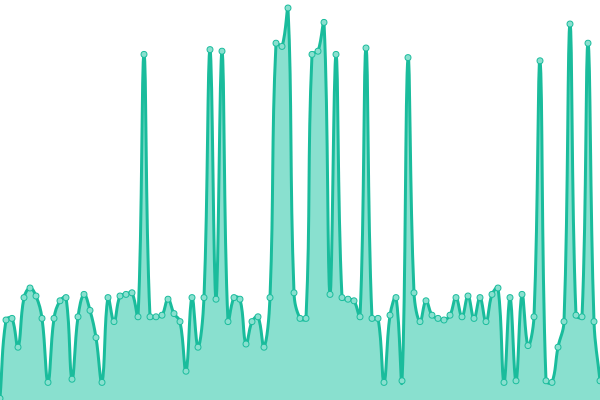 0ms
     
 | 

<a href="https://uptime.jagoanssh.com/history/sg5-ray-ipservers-xyz">0.00%</a>
    

|  [sg6-ray.ipservers.xyz](sg6-ray.ipservers.xyz) | 🟥 Down | [sg6-ray-ipservers-xyz.yml](https://github.com/serversshnet/uptime/commits/HEAD/history/sg6-ray-ipservers-xyz.yml) | 

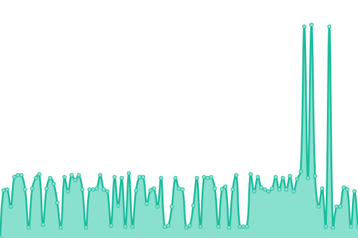 0ms
     
 | 

<a href="https://uptime.jagoanssh.com/history/sg6-ray-ipservers-xyz">0.00%</a>
    

|  [sg1vless.ipservers.xyz](sg1vless.ipservers.xyz) | 🟥 Down | [sg1vless-ipservers-xyz.yml](https://github.com/serversshnet/uptime/commits/HEAD/history/sg1vless-ipservers-xyz.yml) | 

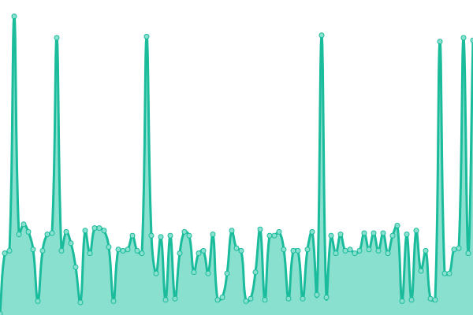 0ms
     
 | 

<a href="https://uptime.jagoanssh.com/history/sg1vless-ipservers-xyz">0.00%</a>
    

|  [sg2vless.ipservers.xyz](sg2vless.ipservers.xyz) | 🟥 Down | [sg2vless-ipservers-xyz.yml](https://github.com/serversshnet/uptime/commits/HEAD/history/sg2vless-ipservers-xyz.yml) | 

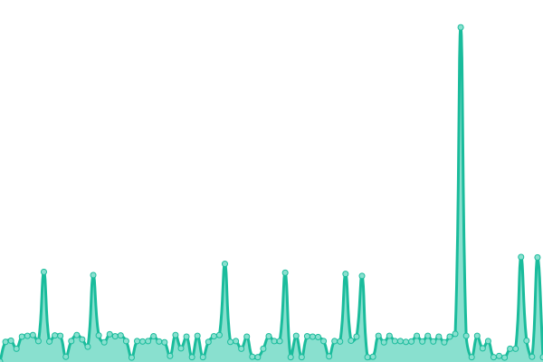 0ms
     
 | 

<a href="https://uptime.jagoanssh.com/history/sg2vless-ipservers-xyz">0.00%</a>
    

|  [sg3vless.ipservers.xyz](sg3vless.ipservers.xyz) | 🟥 Down | [sg3vless-ipservers-xyz.yml](https://github.com/serversshnet/uptime/commits/HEAD/history/sg3vless-ipservers-xyz.yml) | 

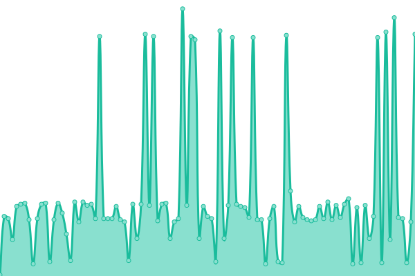 0ms
     
 | 

<a href="https://uptime.jagoanssh.com/history/sg3vless-ipservers-xyz">0.00%</a>
    

|  [sg4vless.ipservers.xyz](sg4vless.ipservers.xyz) | 🟥 Down | [sg4vless-ipservers-xyz.yml](https://github.com/serversshnet/uptime/commits/HEAD/history/sg4vless-ipservers-xyz.yml) | 

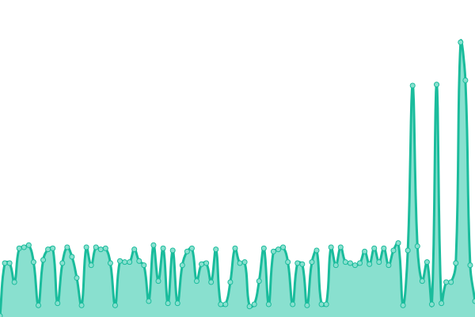 0ms
     
 | 

<a href="https://uptime.jagoanssh.com/history/sg4vless-ipservers-xyz">0.00%</a>
    

|  [sg5vless.ipservers.xyz](sg5vless.ipservers.xyz) | 🟥 Down | [sg5vless-ipservers-xyz.yml](https://github.com/serversshnet/uptime/commits/HEAD/history/sg5vless-ipservers-xyz.yml) | 

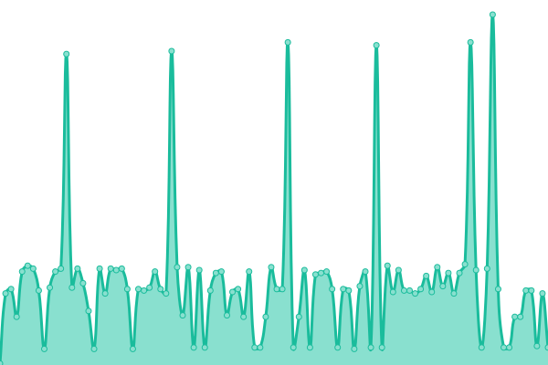 0ms
     
 | 

<a href="https://uptime.jagoanssh.com/history/sg5vless-ipservers-xyz">0.00%</a>
    

|  [sg7-ray.ipservers.xyz](sg7-ray.ipservers.xyz) | 🟥 Down | [sg7-ray-ipservers-xyz.yml](https://github.com/serversshnet/uptime/commits/HEAD/history/sg7-ray-ipservers-xyz.yml) | 

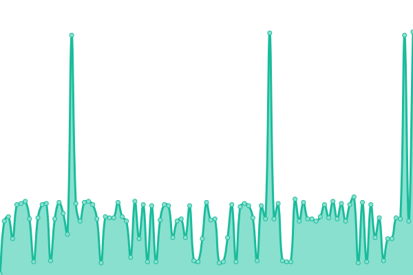 0ms
     
 | 

<a href="https://uptime.jagoanssh.com/history/sg7-ray-ipservers-xyz">0.00%</a>
    

|  [sg8-ray.ipservers.xyz](sg8-ray.ipservers.xyz) | 🟥 Down | [sg8-ray-ipservers-xyz.yml](https://github.com/serversshnet/uptime/commits/HEAD/history/sg8-ray-ipservers-xyz.yml) | 

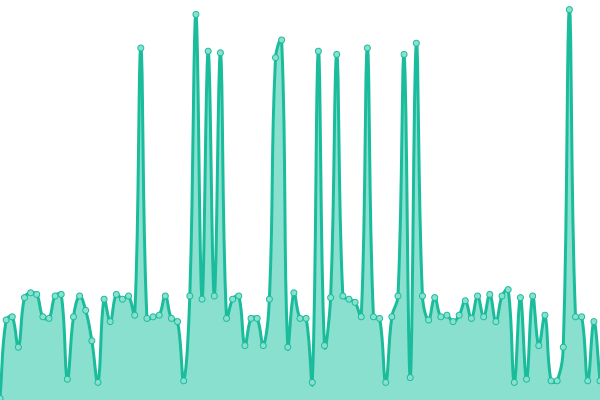 0ms
     
 | 

<a href="https://uptime.jagoanssh.com/history/sg8-ray-ipservers-xyz">0.00%</a>
    

|  [sg1wg.ipservers.xyz](sg1wg.ipservers.xyz) | 🟥 Down | [sg1wg-ipservers-xyz.yml](https://github.com/serversshnet/uptime/commits/HEAD/history/sg1wg-ipservers-xyz.yml) | 

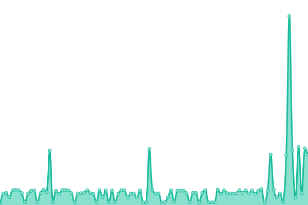 0ms
     
 | 

<a href="https://uptime.jagoanssh.com/history/sg1wg-ipservers-xyz">0.00%</a>
    

|  [sg2wg.ipservers.xyz](sg2wg.ipservers.xyz) | 🟥 Down | [sg2wg-ipservers-xyz.yml](https://github.com/serversshnet/uptime/commits/HEAD/history/sg2wg-ipservers-xyz.yml) | 

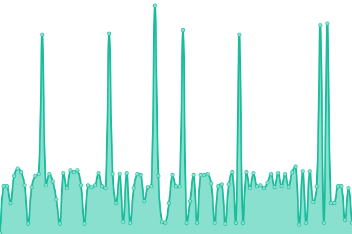 0ms
     
 | 

<a href="https://uptime.jagoanssh.com/history/sg2wg-ipservers-xyz">0.00%</a>
    

|  [sg3wg.ipservers.xyz](sg3wg.ipservers.xyz) | 🟥 Down | [sg3wg-ipservers-xyz.yml](https://github.com/serversshnet/uptime/commits/HEAD/history/sg3wg-ipservers-xyz.yml) | 

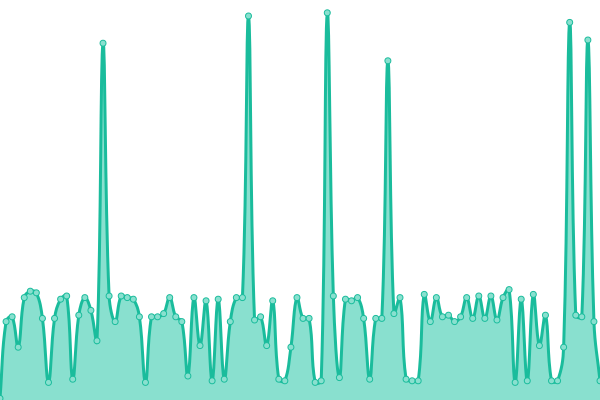 0ms
     
 | 

<a href="https://uptime.jagoanssh.com/history/sg3wg-ipservers-xyz">0.00%</a>
    

|  [us-ray.ipservers.xyz](us-ray.ipservers.xyz) | 🟥 Down | [us-ray-ipservers-xyz.yml](https://github.com/serversshnet/uptime/commits/HEAD/history/us-ray-ipservers-xyz.yml) | 

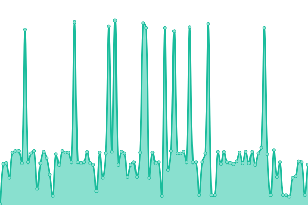 0ms
     
 | 

<a href="https://uptime.jagoanssh.com/history/us-ray-ipservers-xyz">0.00%</a>
    

|  [us2-ray.ipservers.xyz](us2-ray.ipservers.xyz) | 🟥 Down | [us2-ray-ipservers-xyz.yml](https://github.com/serversshnet/uptime/commits/HEAD/history/us2-ray-ipservers-xyz.yml) | 

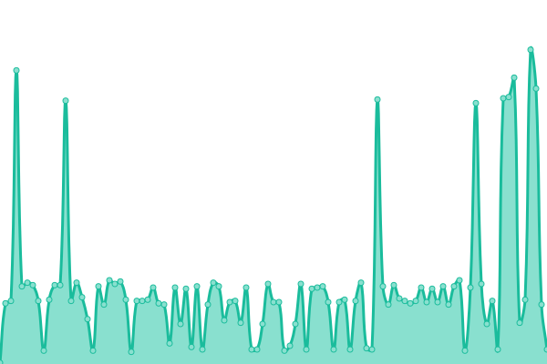 0ms
     
 | 

<a href="https://uptime.jagoanssh.com/history/us2-ray-ipservers-xyz">0.00%</a>
    

|  [sgtro.ipservers.xyz](sgtro.ipservers.xyz) | 🟥 Down | [sgtro-ipservers-xyz.yml](https://github.com/serversshnet/uptime/commits/HEAD/history/sgtro-ipservers-xyz.yml) | 

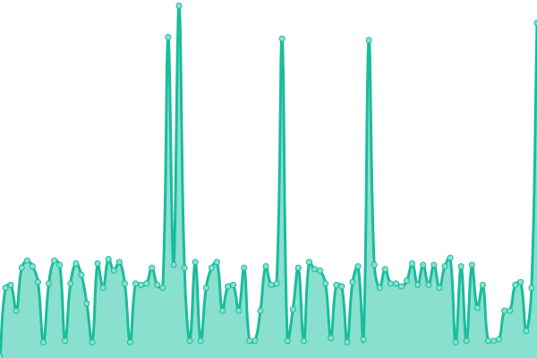 0ms
     
 | 

<a href="https://uptime.jagoanssh.com/history/sgtro-ipservers-xyz">0.00%</a>
    

|  [sg2tro.ipservers.xyz](sg2tro.ipservers.xyz) | 🟥 Down | [sg2tro-ipservers-xyz.yml](https://github.com/serversshnet/uptime/commits/HEAD/history/sg2tro-ipservers-xyz.yml) | 

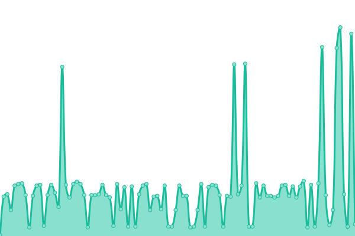 0ms
     
 | 

<a href="https://uptime.jagoanssh.com/history/sg2tro-ipservers-xyz">0.00%</a>
    

|  [sg3tro.ipservers.xyz](sg3tro.ipservers.xyz) | 🟥 Down | [sg3tro-ipservers-xyz.yml](https://github.com/serversshnet/uptime/commits/HEAD/history/sg3tro-ipservers-xyz.yml) | 

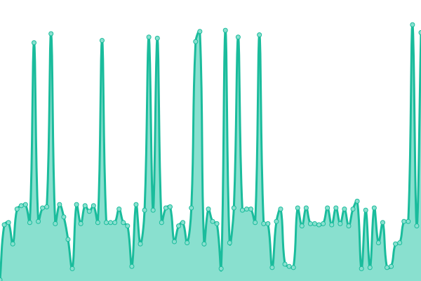 0ms
     
 | 

<a href="https://uptime.jagoanssh.com/history/sg3tro-ipservers-xyz">0.00%</a>
    

|  [ustro.ipservers.xyz](ustro.ipservers.xyz) | 🟥 Down | [ustro-ipservers-xyz.yml](https://github.com/serversshnet/uptime/commits/HEAD/history/ustro-ipservers-xyz.yml) | 

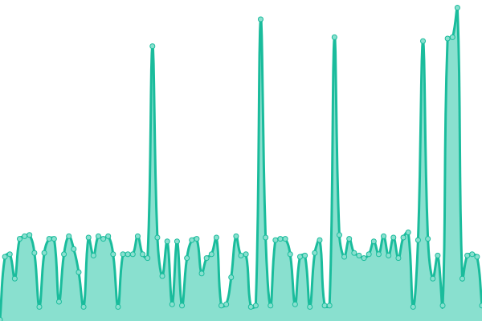 0ms
     
 | 

<a href="https://uptime.jagoanssh.com/history/ustro-ipservers-xyz">0.00%</a>
    

|  [us2tro.ipservers.xyz](us2tro.ipservers.xyz) | 🟥 Down | [us2tro-ipservers-xyz.yml](https://github.com/serversshnet/uptime/commits/HEAD/history/us2tro-ipservers-xyz.yml) | 

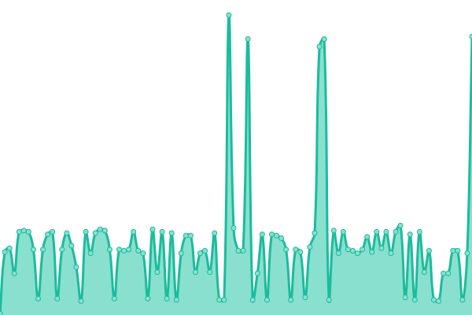 0ms
     
 | 

<a href="https://uptime.jagoanssh.com/history/us2tro-ipservers-xyz">0.00%</a>
    

|  [sg4tro.ipservers.xyz](sg4tro.ipservers.xyz) | 🟥 Down | [sg4tro-ipservers-xyz.yml](https://github.com/serversshnet/uptime/commits/HEAD/history/sg4tro-ipservers-xyz.yml) | 

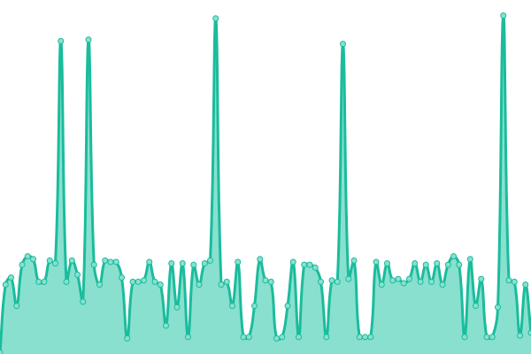 0ms
     
 | 

<a href="https://uptime.jagoanssh.com/history/sg4tro-ipservers-xyz">0.00%</a>
    

|  [sg1go.ipservers.xyz](sg1go.ipservers.xyz) | 🟥 Down | [sg1go-ipservers-xyz.yml](https://github.com/serversshnet/uptime/commits/HEAD/history/sg1go-ipservers-xyz.yml) | 

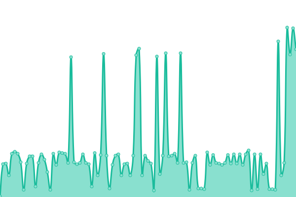 0ms
     
 | 

<a href="https://uptime.jagoanssh.com/history/sg1go-ipservers-xyz">0.00%</a>
    

|  [sg2go.ipservers.xyz](sg2go.ipservers.xyz) | 🟥 Down | [sg2go-ipservers-xyz.yml](https://github.com/serversshnet/uptime/commits/HEAD/history/sg2go-ipservers-xyz.yml) | 

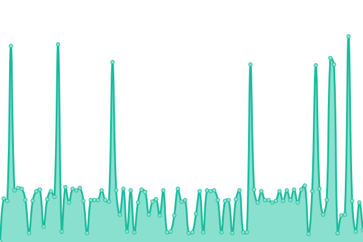 0ms
     
 | 

<a href="https://uptime.jagoanssh.com/history/sg2go-ipservers-xyz">0.00%</a>
    

|  [sg3go.ipservers.xyz](sg3go.ipservers.xyz) | 🟥 Down | [sg3go-ipservers-xyz.yml](https://github.com/serversshnet/uptime/commits/HEAD/history/sg3go-ipservers-xyz.yml) | 

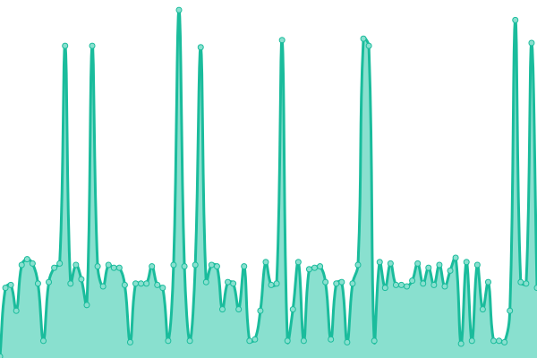 0ms
     
 | 

<a href="https://uptime.jagoanssh.com/history/sg3go-ipservers-xyz">0.00%</a>
    

|  [usgo.ipservers.xyz](usgo.ipservers.xyz) | 🟥 Down | [usgo-ipservers-xyz.yml](https://github.com/serversshnet/uptime/commits/HEAD/history/usgo-ipservers-xyz.yml) | 

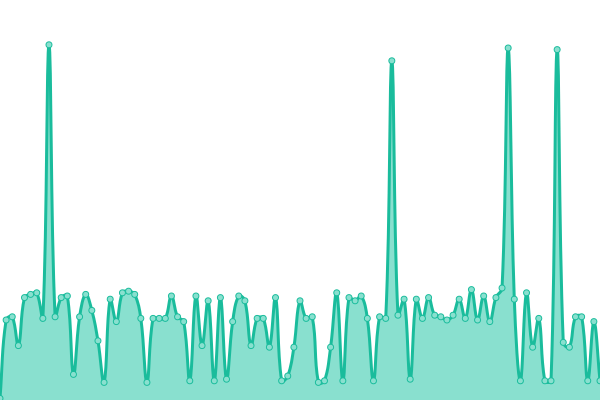 0ms
     
 | 

<a href="https://uptime.jagoanssh.com/history/usgo-ipservers-xyz">0.00%</a>
    

|  [sgcgo.ipservers.xyz](sgcgo.ipservers.xyz) | 🟥 Down | [sgcgo-ipservers-xyz.yml](https://github.com/serversshnet/uptime/commits/HEAD/history/sgcgo-ipservers-xyz.yml) | 

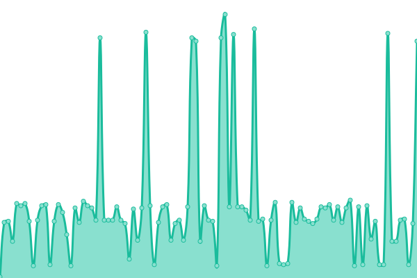 0ms
     
 | 

<a href="https://uptime.jagoanssh.com/history/sgcgo-ipservers-xyz">0.00%</a>
    

|  [sgcvless.ipservers.xyz](sgcvless.ipservers.xyz) | 🟥 Down | [sgcvless-ipservers-xyz.yml](https://github.com/serversshnet/uptime/commits/HEAD/history/sgcvless-ipservers-xyz.yml) | 

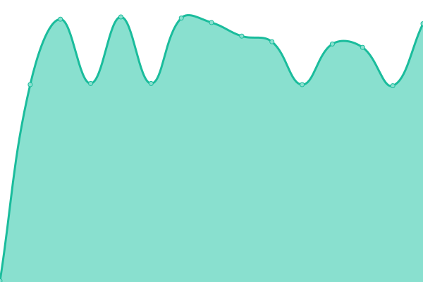 0ms
     
 | 

<a href="https://uptime.jagoanssh.com/history/sgcvless-ipservers-xyz">0.00%</a>
    

|  [us1vless.ipservers.xyz](us1vless.ipservers.xyz) | 🟥 Down | [us1vless-ipservers-xyz.yml](https://github.com/serversshnet/uptime/commits/HEAD/history/us1vless-ipservers-xyz.yml) | 

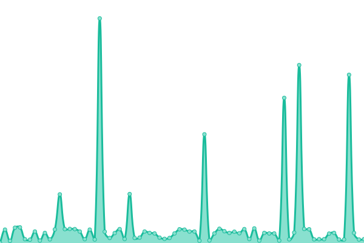 0ms
     
 | 

<a href="https://uptime.jagoanssh.com/history/us1vless-ipservers-xyz">0.00%</a>
    

|  [us2vless.ipservers.xyz](us2vless.ipservers.xyz) | 🟥 Down | [us2vless-ipservers-xyz.yml](https://github.com/serversshnet/uptime/commits/HEAD/history/us2vless-ipservers-xyz.yml) | 

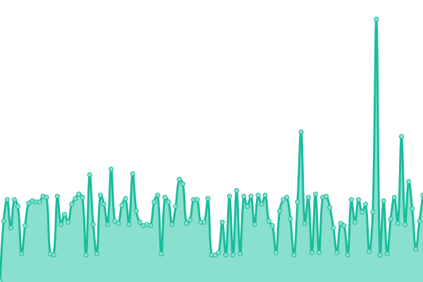 0ms
     
 | 

<a href="https://uptime.jagoanssh.com/history/us2vless-ipservers-xyz">0.00%</a>
    

|  [id1-ray.ipservers.xyz](id1-ray.ipservers.xyz) | 🟥 Down | [id1-ray-ipservers-xyz.yml](https://github.com/serversshnet/uptime/commits/HEAD/history/id1-ray-ipservers-xyz.yml) | 

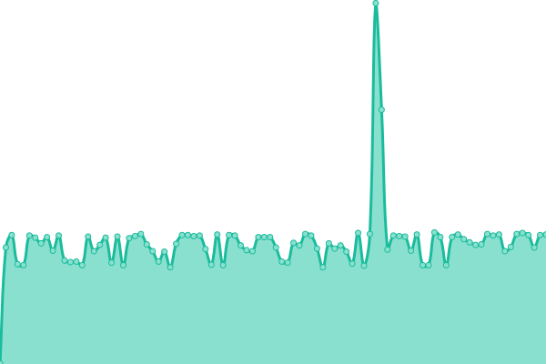 0ms
     
 | 

<a href="https://uptime.jagoanssh.com/history/id1-ray-ipservers-xyz">0.00%</a>
    

|  [id2-ray.ipservers.xyz](id2-ray.ipservers.xyz) | 🟥 Down | [id2-ray-ipservers-xyz.yml](https://github.com/serversshnet/uptime/commits/HEAD/history/id2-ray-ipservers-xyz.yml) | 

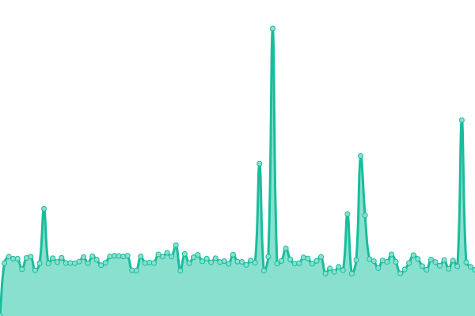 0ms
     
 | 

<a href="https://uptime.jagoanssh.com/history/id2-ray-ipservers-xyz">0.00%</a>
    

|  [ca-ray.ipservers.xyz](ca-ray.ipservers.xyz) | 🟥 Down | [ca-ray-ipservers-xyz.yml](https://github.com/serversshnet/uptime/commits/HEAD/history/ca-ray-ipservers-xyz.yml) | 

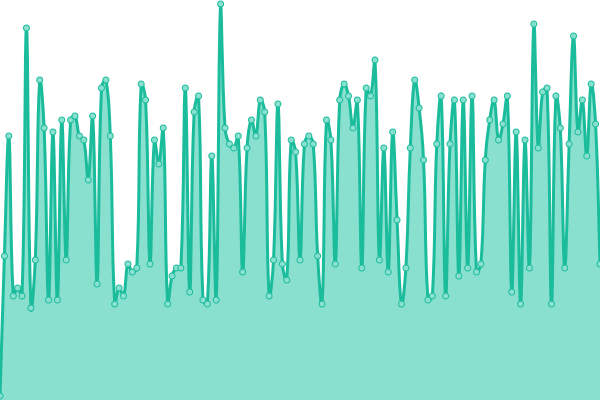 0ms
     
 | 

<a href="https://uptime.jagoanssh.com/history/ca-ray-ipservers-xyz">0.00%</a>
    

|  [au-ray.ipservers.xyz](au-ray.ipservers.xyz) | 🟥 Down | [au-ray-ipservers-xyz.yml](https://github.com/serversshnet/uptime/commits/HEAD/history/au-ray-ipservers-xyz.yml) | 

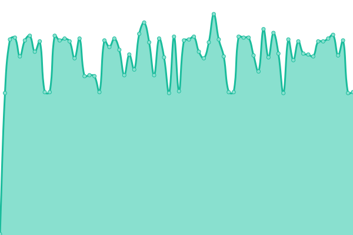 0ms
     
 | 

<a href="https://uptime.jagoanssh.com/history/au-ray-ipservers-xyz">0.00%</a>
    

|  [fr-ray.ipservers.xyz](fr-ray.ipservers.xyz) | 🟥 Down | [fr-ray-ipservers-xyz.yml](https://github.com/serversshnet/uptime/commits/HEAD/history/fr-ray-ipservers-xyz.yml) | 

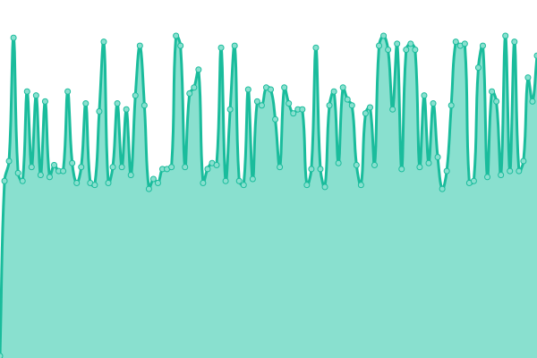 0ms
     
 | 

<a href="https://uptime.jagoanssh.com/history/fr-ray-ipservers-xyz">0.00%</a>
    

|  [ge-ray.ipservers.xyz](ge-ray.ipservers.xyz) | 🟥 Down | [ge-ray-ipservers-xyz.yml](https://github.com/serversshnet/uptime/commits/HEAD/history/ge-ray-ipservers-xyz.yml) | 

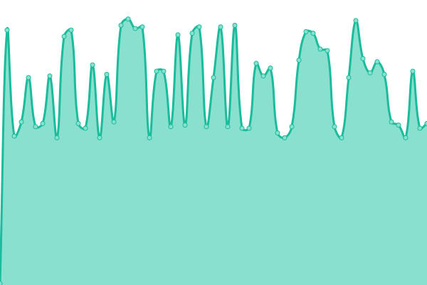 0ms
     
 | 

<a href="https://uptime.jagoanssh.com/history/ge-ray-ipservers-xyz">0.00%</a>
    

|  [id1vless.ipservers.xyz](id1vless.ipservers.xyz) | 🟥 Down | [id1vless-ipservers-xyz.yml](https://github.com/serversshnet/uptime/commits/HEAD/history/id1vless-ipservers-xyz.yml) | 

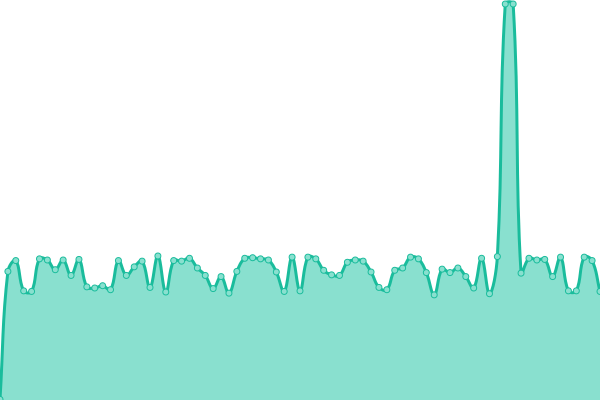 0ms
     
 | 

<a href="https://uptime.jagoanssh.com/history/id1vless-ipservers-xyz">0.00%</a>
    

|  [id2vless.ipservers.xyz](id2vless.ipservers.xyz) | 🟥 Down | [id2vless-ipservers-xyz.yml](https://github.com/serversshnet/uptime/commits/HEAD/history/id2vless-ipservers-xyz.yml) | 

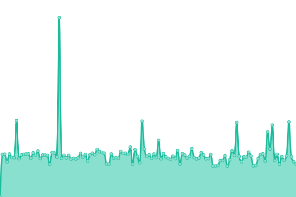 0ms
     
 | 

<a href="https://uptime.jagoanssh.com/history/id2vless-ipservers-xyz">0.00%</a>
    

|  [auvless.ipservers.xyz](auvless.ipservers.xyz) | 🟥 Down | [auvless-ipservers-xyz.yml](https://github.com/serversshnet/uptime/commits/HEAD/history/auvless-ipservers-xyz.yml) | 

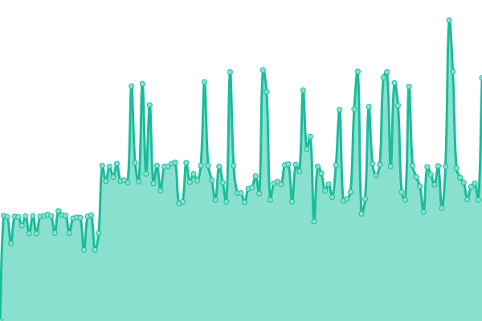 0ms
     
 | 

<a href="https://uptime.jagoanssh.com/history/auvless-ipservers-xyz">0.00%</a>
    

|  [cavless.ipservers.xyz](cavless.ipservers.xyz) | 🟥 Down | [cavless-ipservers-xyz.yml](https://github.com/serversshnet/uptime/commits/HEAD/history/cavless-ipservers-xyz.yml) | 

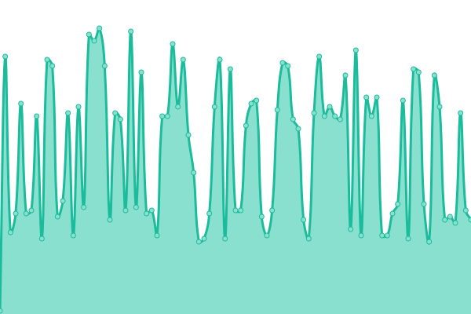 0ms
     
 | 

<a href="https://uptime.jagoanssh.com/history/cavless-ipservers-xyz">0.00%</a>
    

|  [gevless.ipservers.xyz](gevless.ipservers.xyz) | 🟥 Down | [gevless-ipservers-xyz.yml](https://github.com/serversshnet/uptime/commits/HEAD/history/gevless-ipservers-xyz.yml) | 

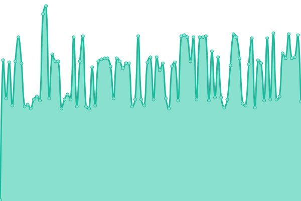 0ms
     
 | 

<a href="https://uptime.jagoanssh.com/history/gevless-ipservers-xyz">0.00%</a>
    

|  [frvless.ipservers.xyz](frvless.ipservers.xyz) | 🟥 Down | [frvless-ipservers-xyz.yml](https://github.com/serversshnet/uptime/commits/HEAD/history/frvless-ipservers-xyz.yml) | 

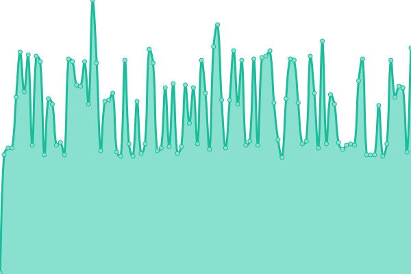 0ms
     
 | 

<a href="https://uptime.jagoanssh.com/history/frvless-ipservers-xyz">0.00%</a>
    

|  [id1go.ipservers.xyz](id1go.ipservers.xyz) | 🟥 Down | [id1go-ipservers-xyz.yml](https://github.com/serversshnet/uptime/commits/HEAD/history/id1go-ipservers-xyz.yml) | 

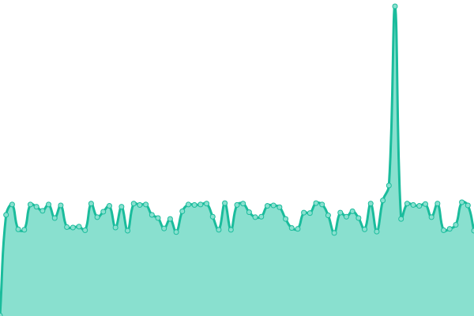 0ms
     
 | 

<a href="https://uptime.jagoanssh.com/history/id1go-ipservers-xyz">0.00%</a>
    

|  [id2go.ipservers.xyz](id2go.ipservers.xyz) | 🟥 Down | [id2go-ipservers-xyz.yml](https://github.com/serversshnet/uptime/commits/HEAD/history/id2go-ipservers-xyz.yml) | 

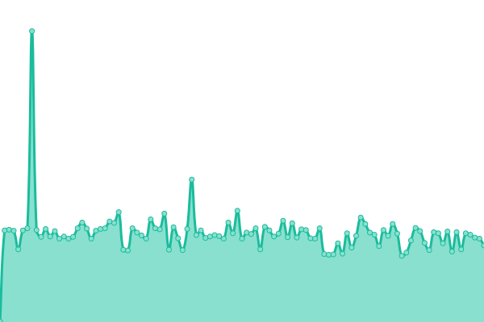 0ms
     
 | 

<a href="https://uptime.jagoanssh.com/history/id2go-ipservers-xyz">0.00%</a>
    

|  [augo.ipservers.xyz](augo.ipservers.xyz) | 🟥 Down | [augo-ipservers-xyz.yml](https://github.com/serversshnet/uptime/commits/HEAD/history/augo-ipservers-xyz.yml) | 

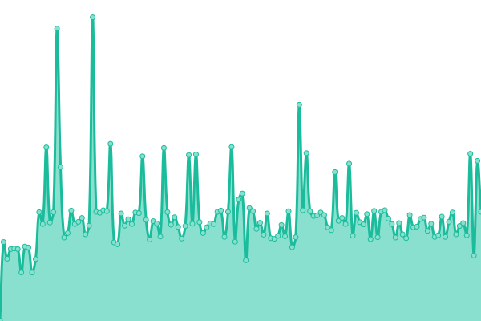 0ms
     
 | 

<a href="https://uptime.jagoanssh.com/history/augo-ipservers-xyz">0.00%</a>
    

|  [cago.ipservers.xyz](cago.ipservers.xyz) | 🟥 Down | [cago-ipservers-xyz.yml](https://github.com/serversshnet/uptime/commits/HEAD/history/cago-ipservers-xyz.yml) | 

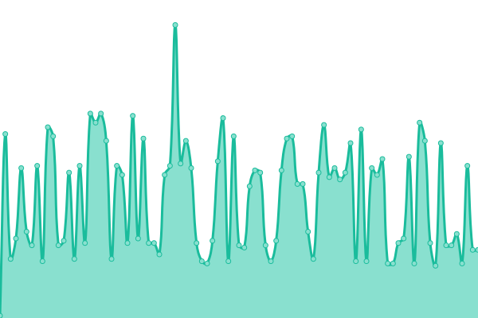 0ms
     
 | 

<a href="https://uptime.jagoanssh.com/history/cago-ipservers-xyz">0.00%</a>
    

|  [frgo.ipservers.xyz](frgo.ipservers.xyz) | 🟥 Down | [frgo-ipservers-xyz.yml](https://github.com/serversshnet/uptime/commits/HEAD/history/frgo-ipservers-xyz.yml) | 

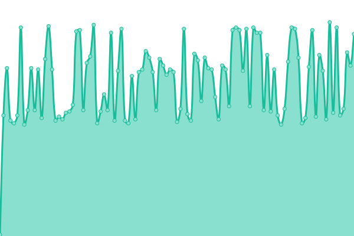 0ms
     
 | 

<a href="https://uptime.jagoanssh.com/history/frgo-ipservers-xyz">0.00%</a>
    

|  [dego.ipservers.xyz](dego.ipservers.xyz) | 🟥 Down | [dego-ipservers-xyz.yml](https://github.com/serversshnet/uptime/commits/HEAD/history/dego-ipservers-xyz.yml) | 

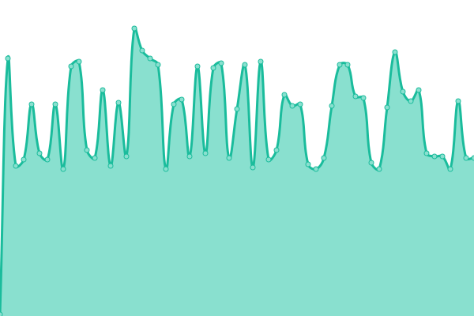 0ms
     
 | 

<a href="https://uptime.jagoanssh.com/history/dego-ipservers-xyz">0.00%</a>
    

|  [idtro.ipservers.xyz](idtro.ipservers.xyz) | 🟥 Down | [idtro-ipservers-xyz.yml](https://github.com/serversshnet/uptime/commits/HEAD/history/idtro-ipservers-xyz.yml) | 

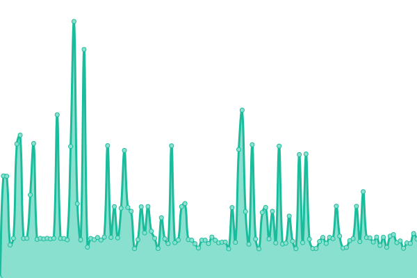 0ms
     
 | 

<a href="https://uptime.jagoanssh.com/history/idtro-ipservers-xyz">0.00%</a>
    

|  [id2tro.ipservers.xyz](id2tro.ipservers.xyz) | 🟥 Down | [id2tro-ipservers-xyz.yml](https://github.com/serversshnet/uptime/commits/HEAD/history/id2tro-ipservers-xyz.yml) | 

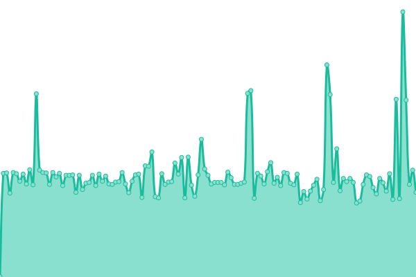 0ms
     
 | 

<a href="https://uptime.jagoanssh.com/history/id2tro-ipservers-xyz">0.00%</a>
    

|  [autro.ipservers.xyz](autro.ipservers.xyz) | 🟥 Down | [autro-ipservers-xyz.yml](https://github.com/serversshnet/uptime/commits/HEAD/history/autro-ipservers-xyz.yml) | 

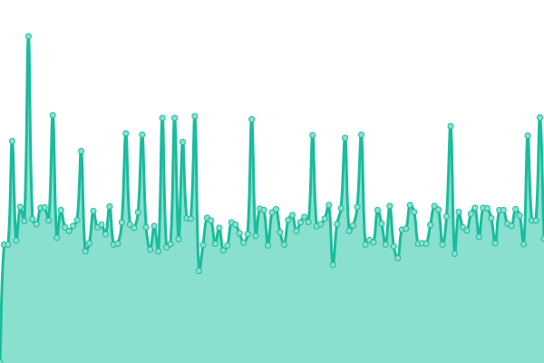 0ms
     
 | 

<a href="https://uptime.jagoanssh.com/history/autro-ipservers-xyz">0.00%</a>
    

|  [catro.ipservers.xyz](catro.ipservers.xyz) | 🟥 Down | [catro-ipservers-xyz.yml](https://github.com/serversshnet/uptime/commits/HEAD/history/catro-ipservers-xyz.yml) | 

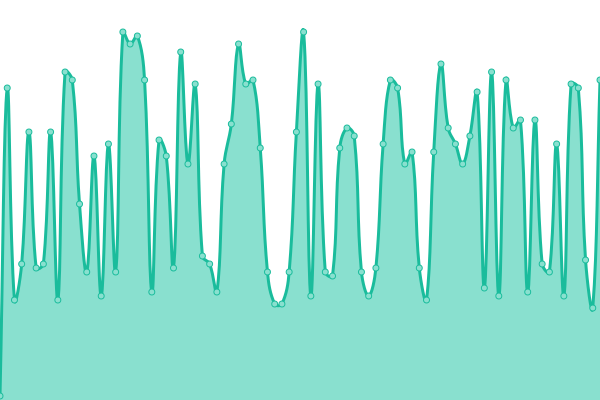 0ms
     
 | 

<a href="https://uptime.jagoanssh.com/history/catro-ipservers-xyz">0.00%</a>
    

|  [frtro.ipservers.xyz](frtro.ipservers.xyz) | 🟥 Down | [frtro-ipservers-xyz.yml](https://github.com/serversshnet/uptime/commits/HEAD/history/frtro-ipservers-xyz.yml) | 

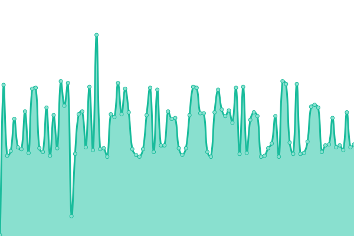 0ms
     
 | 

<a href="https://uptime.jagoanssh.com/history/frtro-ipservers-xyz">0.00%</a>
    

|  [detro.ipservers.xyz](detro.ipservers.xyz) | 🟥 Down | [detro-ipservers-xyz.yml](https://github.com/serversshnet/uptime/commits/HEAD/history/detro-ipservers-xyz.yml) | 

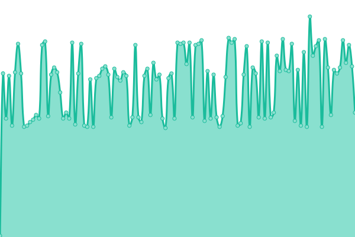 0ms
     
 | 

<a href="https://uptime.jagoanssh.com/history/detro-ipservers-xyz">0.00%</a>
    

<!--end: status pages-->

[**Visit our status website →**](https://tinyurl.com/jagoanuptime)

## 📄 License

- Powered by: [Upptime](https://github.com/upptime/upptime)
- Code: [MIT](./LICENSE) © [ADMIN SERVERSSH.NET](https://serverssh.net)
- Data in the `./history` directory: [Open Database License](https://opendatacommons.org/licenses/odbl/1-0/)
