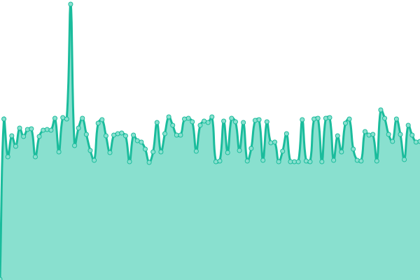

# [📈 Live Status](https://tinyurl.com/jagoanuptime): <!--live status--> **🟩 All systems operational**

<!--start: status pages-->
<!-- This summary is generated by Upptime (https://github.com/upptime/upptime) -->
<!-- Do not edit this manually, your changes will be overwritten -->
<!-- prettier-ignore -->
| URL | Status | History | Response Time | Uptime |
| --- | ------ | ------- | ------------- | ------ |
|  [Jagoanssh - Website](jagoanssh.com) | 🟩 Up | [jagoanssh-website.yml](https://github.com/serversshnet/uptime/commits/HEAD/history/jagoanssh-website.yml) | 

 19ms
     
 | 

<a href="https://uptime.jagoanssh.com/history/jagoanssh-website">100.00%</a>
    

|  [sg1.ipservers.xyz](sg1.ipservers.xyz) | 🟩 Up | [sg1-ipservers-xyz.yml](https://github.com/serversshnet/uptime/commits/HEAD/history/sg1-ipservers-xyz.yml) | 

 317ms
     
 | 

<a href="https://uptime.jagoanssh.com/history/sg1-ipservers-xyz">100.00%</a>
    

|  [sg2.ipservers.xyz](sg2.ipservers.xyz) | 🟩 Up | [sg2-ipservers-xyz.yml](https://github.com/serversshnet/uptime/commits/HEAD/history/sg2-ipservers-xyz.yml) | 

 374ms
     
 | 

<a href="https://uptime.jagoanssh.com/history/sg2-ipservers-xyz">100.00%</a>
    

|  [sg3.ipservers.xyz](sg3.ipservers.xyz) | 🟩 Up | [sg3-ipservers-xyz.yml](https://github.com/serversshnet/uptime/commits/HEAD/history/sg3-ipservers-xyz.yml) | 

 230ms
     
 | 

<a href="https://uptime.jagoanssh.com/history/sg3-ipservers-xyz">100.00%</a>
    

|  [sg4.ipservers.xyz](sg4.ipservers.xyz) | 🟩 Up | [sg4-ipservers-xyz.yml](https://github.com/serversshnet/uptime/commits/HEAD/history/sg4-ipservers-xyz.yml) | 

 225ms
     
 | 

<a href="https://uptime.jagoanssh.com/history/sg4-ipservers-xyz">99.75%</a>
    

|  [sg5.ipservers.xyz](sg5.ipservers.xyz) | 🟩 Up | [sg5-ipservers-xyz.yml](https://github.com/serversshnet/uptime/commits/HEAD/history/sg5-ipservers-xyz.yml) | 

 225ms
     
 | 

<a href="https://uptime.jagoanssh.com/history/sg5-ipservers-xyz">100.00%</a>
    

|  [sg6.ipservers.xyz](sg6.ipservers.xyz) | 🟩 Up | [sg6-ipservers-xyz.yml](https://github.com/serversshnet/uptime/commits/HEAD/history/sg6-ipservers-xyz.yml) | 

 225ms
     
 | 

<a href="https://uptime.jagoanssh.com/history/sg6-ipservers-xyz">100.00%</a>
    

|  [id.ipservers.xyz](id.ipservers.xyz) | 🟩 Up | [id-ipservers-xyz.yml](https://github.com/serversshnet/uptime/commits/HEAD/history/id-ipservers-xyz.yml) | 

 298ms
     
 | 

<a href="https://uptime.jagoanssh.com/history/id-ipservers-xyz">100.00%</a>
    

|  [id2.ipservers.xyz](id2.ipservers.xyz) | 🟩 Up | [id2-ipservers-xyz.yml](https://github.com/serversshnet/uptime/commits/HEAD/history/id2-ipservers-xyz.yml) | 

 410ms
     
 | 

<a href="https://uptime.jagoanssh.com/history/id2-ipservers-xyz">100.00%</a>
    

|  [id3.ipservers.xyz](id3.ipservers.xyz) | 🟩 Up | [id3-ipservers-xyz.yml](https://github.com/serversshnet/uptime/commits/HEAD/history/id3-ipservers-xyz.yml) | 

 339ms
     
 | 

<a href="https://uptime.jagoanssh.com/history/id3-ipservers-xyz">100.00%</a>
    

|  [us1.ipservers.xyz](us1.ipservers.xyz) | 🟩 Up | [us1-ipservers-xyz.yml](https://github.com/serversshnet/uptime/commits/HEAD/history/us1-ipservers-xyz.yml) | 

 43ms
     
 | 

<a href="https://uptime.jagoanssh.com/history/us1-ipservers-xyz">100.00%</a>
    

|  [uk1.ipservers.xyz](uk1.ipservers.xyz) | 🟩 Up | [uk1-ipservers-xyz.yml](https://github.com/serversshnet/uptime/commits/HEAD/history/uk1-ipservers-xyz.yml) | 

 62ms
     
 | 

<a href="https://uptime.jagoanssh.com/history/uk1-ipservers-xyz">100.00%</a>
    

|  [fr.ipservers.xyz](fr.ipservers.xyz) | 🟩 Up | [fr-ipservers-xyz.yml](https://github.com/serversshnet/uptime/commits/HEAD/history/fr-ipservers-xyz.yml) | 

 121ms
     
 | 

<a href="https://uptime.jagoanssh.com/history/fr-ipservers-xyz">100.00%</a>
    

|  [ge.ipservers.xyz](ge.ipservers.xyz) | 🟩 Up | [ge-ipservers-xyz.yml](https://github.com/serversshnet/uptime/commits/HEAD/history/ge-ipservers-xyz.yml) | 

 127ms
     
 | 

<a href="https://uptime.jagoanssh.com/history/ge-ipservers-xyz">100.00%</a>
    

|  [sg1-7.ipservers.xyz](sg1-7.ipservers.xyz) | 🟩 Up | [sg1-7-ipservers-xyz.yml](https://github.com/serversshnet/uptime/commits/HEAD/history/sg1-7-ipservers-xyz.yml) | 

 357ms
     
 | 

<a href="https://uptime.jagoanssh.com/history/sg1-7-ipservers-xyz">100.00%</a>
    

|  [sg2-7.ipservers.xyz](sg2-7.ipservers.xyz) | 🟩 Up | [sg2-7-ipservers-xyz.yml](https://github.com/serversshnet/uptime/commits/HEAD/history/sg2-7-ipservers-xyz.yml) | 

 337ms
     
 | 

<a href="https://uptime.jagoanssh.com/history/sg2-7-ipservers-xyz">100.00%</a>
    

|  [sg3-7.ipservers.xyz](sg3-7.ipservers.xyz) | 🟩 Up | [sg3-7-ipservers-xyz.yml](https://github.com/serversshnet/uptime/commits/HEAD/history/sg3-7-ipservers-xyz.yml) | 

 222ms
     
 | 

<a href="https://uptime.jagoanssh.com/history/sg3-7-ipservers-xyz">100.00%</a>
    

|  [sg4-7.ipservers.xyz](sg4-7.ipservers.xyz) | 🟩 Up | [sg4-7-ipservers-xyz.yml](https://github.com/serversshnet/uptime/commits/HEAD/history/sg4-7-ipservers-xyz.yml) | 

 223ms
     
 | 

<a href="https://uptime.jagoanssh.com/history/sg4-7-ipservers-xyz">100.00%</a>
    

|  [us1-7.ipservers.xyz](us1-7.ipservers.xyz) | 🟩 Up | [us1-7-ipservers-xyz.yml](https://github.com/serversshnet/uptime/commits/HEAD/history/us1-7-ipservers-xyz.yml) | 

 39ms
     
 | 

<a href="https://uptime.jagoanssh.com/history/us1-7-ipservers-xyz">100.00%</a>
    

|  [uk1-7.ipservers.xyz](uk1-7.ipservers.xyz) | 🟩 Up | [uk1-7-ipservers-xyz.yml](https://github.com/serversshnet/uptime/commits/HEAD/history/uk1-7-ipservers-xyz.yml) | 

 61ms
     
 | 

<a href="https://uptime.jagoanssh.com/history/uk1-7-ipservers-xyz">100.00%</a>
    

|  [id1-7.ipservers.xyz](id1-7.ipservers.xyz) | 🟩 Up | [id1-7-ipservers-xyz.yml](https://github.com/serversshnet/uptime/commits/HEAD/history/id1-7-ipservers-xyz.yml) | 

 288ms
     
 | 

<a href="https://uptime.jagoanssh.com/history/id1-7-ipservers-xyz">100.00%</a>
    

|  [id2-7.ipservers.xyz](id2-7.ipservers.xyz) | 🟩 Up | [id2-7-ipservers-xyz.yml](https://github.com/serversshnet/uptime/commits/HEAD/history/id2-7-ipservers-xyz.yml) | 

 364ms
     
 | 

<a href="https://uptime.jagoanssh.com/history/id2-7-ipservers-xyz">100.00%</a>
    

|  [id3-7.ipservers.xyz](id3-7.ipservers.xyz) | 🟩 Up | [id3-7-ipservers-xyz.yml](https://github.com/serversshnet/uptime/commits/HEAD/history/id3-7-ipservers-xyz.yml) | 

 298ms
     
 | 

<a href="https://uptime.jagoanssh.com/history/id3-7-ipservers-xyz">100.00%</a>
    

|  [fr1-7.ipservers.xyz](fr1-7.ipservers.xyz) | 🟩 Up | [fr1-7-ipservers-xyz.yml](https://github.com/serversshnet/uptime/commits/HEAD/history/fr1-7-ipservers-xyz.yml) | 

 122ms
     
 | 

<a href="https://uptime.jagoanssh.com/history/fr1-7-ipservers-xyz">100.00%</a>
    

|  [ge1-7.ipservers.xyz](ge1-7.ipservers.xyz) | 🟩 Up | [ge1-7-ipservers-xyz.yml](https://github.com/serversshnet/uptime/commits/HEAD/history/ge1-7-ipservers-xyz.yml) | 

 125ms
     
 | 

<a href="https://uptime.jagoanssh.com/history/ge1-7-ipservers-xyz">100.00%</a>
    

|  [sg1-30.ipservers.xyz](sg1-30.ipservers.xyz) | 🟩 Up | [sg1-30-ipservers-xyz.yml](https://github.com/serversshnet/uptime/commits/HEAD/history/sg1-30-ipservers-xyz.yml) | 

 404ms
     
 | 

<a href="https://uptime.jagoanssh.com/history/sg1-30-ipservers-xyz">100.00%</a>
    

|  [sg2-30.ipservers.xyz](sg2-30.ipservers.xyz) | 🟩 Up | [sg2-30-ipservers-xyz.yml](https://github.com/serversshnet/uptime/commits/HEAD/history/sg2-30-ipservers-xyz.yml) | 

 221ms
     
 | 

<a href="https://uptime.jagoanssh.com/history/sg2-30-ipservers-xyz">100.00%</a>
    

|  [sg3-30.ipservers.xyz](sg3-30.ipservers.xyz) | 🟩 Up | [sg3-30-ipservers-xyz.yml](https://github.com/serversshnet/uptime/commits/HEAD/history/sg3-30-ipservers-xyz.yml) | 

 222ms
     
 | 

<a href="https://uptime.jagoanssh.com/history/sg3-30-ipservers-xyz">100.00%</a>
    

|  [sg4-30.ipservers.xyz](sg4-30.ipservers.xyz) | 🟩 Up | [sg4-30-ipservers-xyz.yml](https://github.com/serversshnet/uptime/commits/HEAD/history/sg4-30-ipservers-xyz.yml) | 

 221ms
     
 | 

<a href="https://uptime.jagoanssh.com/history/sg4-30-ipservers-xyz">100.00%</a>
    

|  [us1-30.ipservers.xyz](us1-30.ipservers.xyz) | 🟩 Up | [us1-30-ipservers-xyz.yml](https://github.com/serversshnet/uptime/commits/HEAD/history/us1-30-ipservers-xyz.yml) | 

 39ms
     
 | 

<a href="https://uptime.jagoanssh.com/history/us1-30-ipservers-xyz">100.00%</a>
    

|  [uk1-30.ipservers.xyz](uk1-30.ipservers.xyz) | 🟩 Up | [uk1-30-ipservers-xyz.yml](https://github.com/serversshnet/uptime/commits/HEAD/history/uk1-30-ipservers-xyz.yml) | 

 62ms
     
 | 

<a href="https://uptime.jagoanssh.com/history/uk1-30-ipservers-xyz">100.00%</a>
    

|  [vip.ipservers.xyz](vip.ipservers.xyz) | 🟩 Up | [vip-ipservers-xyz.yml](https://github.com/serversshnet/uptime/commits/HEAD/history/vip-ipservers-xyz.yml) | 

 483ms
     
 | 

<a href="https://uptime.jagoanssh.com/history/vip-ipservers-xyz">100.00%</a>
    

|  [vip2.ipservers.xyz](vip2.ipservers.xyz) | 🟩 Up | [vip2-ipservers-xyz.yml](https://github.com/serversshnet/uptime/commits/HEAD/history/vip2-ipservers-xyz.yml) | 

 361ms
     
 | 

<a href="https://uptime.jagoanssh.com/history/vip2-ipservers-xyz">100.00%</a>
    

|  [sg.vmes.xyz](sg.vmes.xyz) | 🟩 Up | [sg-vmes-xyz.yml](https://github.com/serversshnet/uptime/commits/HEAD/history/sg-vmes-xyz.yml) | 

 236ms
     
 | 

<a href="https://uptime.jagoanssh.com/history/sg-vmes-xyz">100.00%</a>
    

|  [sg2.vmes.xyz](sg2.vmes.xyz) | 🟩 Up | [sg2-vmes-xyz.yml](https://github.com/serversshnet/uptime/commits/HEAD/history/sg2-vmes-xyz.yml) | 

 243ms
     
 | 

<a href="https://uptime.jagoanssh.com/history/sg2-vmes-xyz">100.00%</a>
    

|  [sg3.vmes.xyz](sg3.vmes.xyz) | 🟩 Up | [sg3-vmes-xyz.yml](https://github.com/serversshnet/uptime/commits/HEAD/history/sg3-vmes-xyz.yml) | 

 234ms
     
 | 

<a href="https://uptime.jagoanssh.com/history/sg3-vmes-xyz">100.00%</a>
    

|  [sg4.vmes.xyz](sg4.vmes.xyz) | 🟩 Up | [sg4-vmes-xyz.yml](https://github.com/serversshnet/uptime/commits/HEAD/history/sg4-vmes-xyz.yml) | 

 234ms
     
 | 

<a href="https://uptime.jagoanssh.com/history/sg4-vmes-xyz">100.00%</a>
    

|  [sg4.vmes.xyz](sg4.vmes.xyz) | 🟩 Up | [sg4-vmes-xyz.yml](https://github.com/serversshnet/uptime/commits/HEAD/history/sg4-vmes-xyz.yml) | 

 234ms
     
 | 

<a href="https://uptime.jagoanssh.com/history/sg4-vmes-xyz">100.00%</a>
    

|  [sg5.vmes.xyz](sg5.vmes.xyz) | 🟩 Up | [sg5-vmes-xyz.yml](https://github.com/serversshnet/uptime/commits/HEAD/history/sg5-vmes-xyz.yml) | 

 237ms
     
 | 

<a href="https://uptime.jagoanssh.com/history/sg5-vmes-xyz">100.00%</a>
    

|  [sg6.vmes.xyz](sg6.vmes.xyz) | 🟩 Up | [sg6-vmes-xyz.yml](https://github.com/serversshnet/uptime/commits/HEAD/history/sg6-vmes-xyz.yml) | 

 233ms
     
 | 

<a href="https://uptime.jagoanssh.com/history/sg6-vmes-xyz">100.00%</a>
    

|  [sg7.vmes.xyz](sg7.vmes.xyz) | 🟩 Up | [sg7-vmes-xyz.yml](https://github.com/serversshnet/uptime/commits/HEAD/history/sg7-vmes-xyz.yml) | 

 236ms
     
 | 

<a href="https://uptime.jagoanssh.com/history/sg7-vmes-xyz">100.00%</a>
    

|  [sg8.vmes.xyz](sg8.vmes.xyz) | 🟩 Up | [sg8-vmes-xyz.yml](https://github.com/serversshnet/uptime/commits/HEAD/history/sg8-vmes-xyz.yml) | 

 242ms
     
 | 

<a href="https://uptime.jagoanssh.com/history/sg8-vmes-xyz">100.00%</a>
    

|  [us.vmes.xyz](us.vmes.xyz) | 🟩 Up | [us-vmes-xyz.yml](https://github.com/serversshnet/uptime/commits/HEAD/history/us-vmes-xyz.yml) | 

 18ms
     
 | 

<a href="https://uptime.jagoanssh.com/history/us-vmes-xyz">100.00%</a>
    

|  [us2.vmes.xyz](us2.vmes.xyz) | 🟩 Up | [us2-vmes-xyz.yml](https://github.com/serversshnet/uptime/commits/HEAD/history/us2-vmes-xyz.yml) | 

 76ms
     
 | 

<a href="https://uptime.jagoanssh.com/history/us2-vmes-xyz">100.00%</a>
    

<!--end: status pages-->

[**Visit our status website →**](https://tinyurl.com/jagoanuptime)

## 📄 License

- Powered by: [Upptime](https://github.com/upptime/upptime)
- Code: [MIT](./LICENSE) © [ADMIN SERVERSSH.NET](https://serverssh.net)
- Data in the `./history` directory: [Open Database License](https://opendatacommons.org/licenses/odbl/1-0/)
